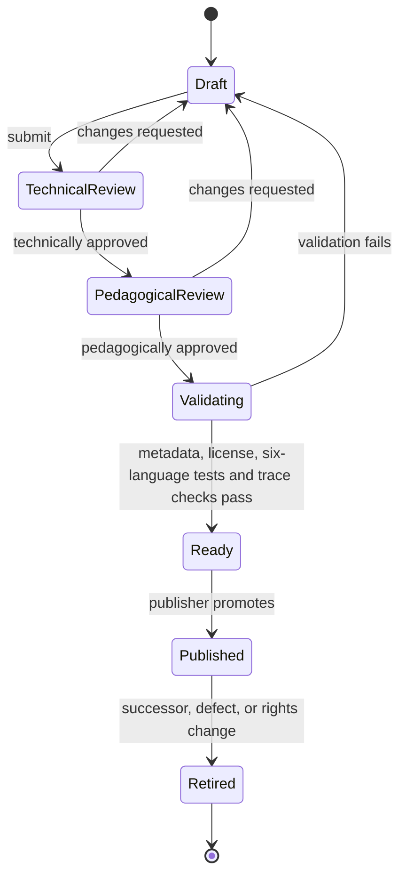
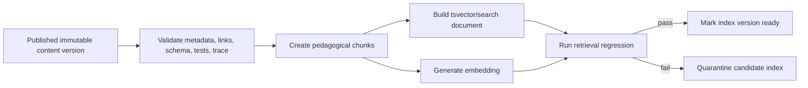
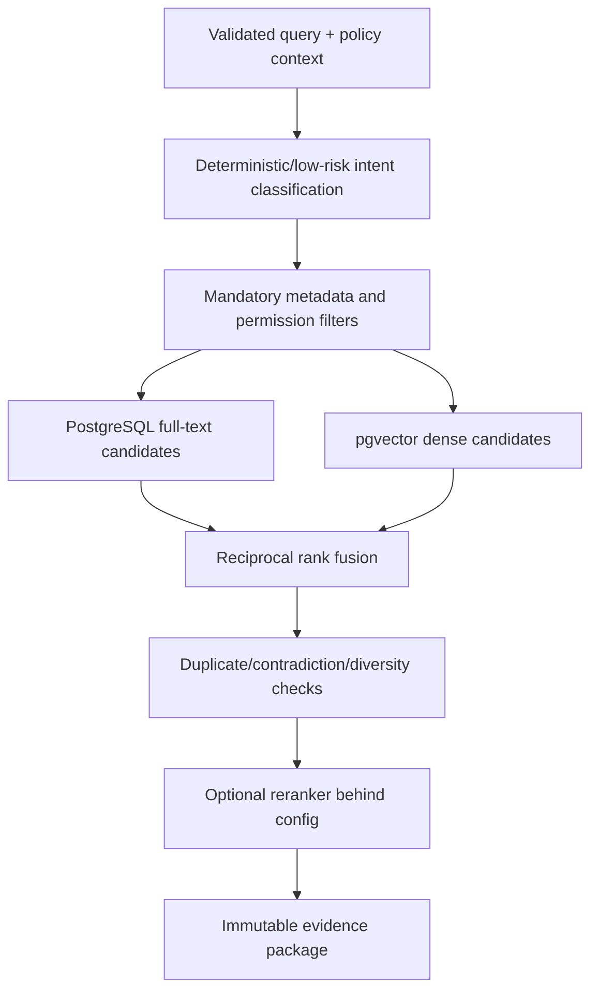

# Data and AI architecture

**Status:** Proposed  
**Primary store:** PostgreSQL with pgvector  
**Design rule:** Data that changes learning or safety outcomes must be versioned, attributable, and reproducible

## 1. Data domains and ownership

AlgoCove uses one physical PostgreSQL database initially, but ownership is logical and strict. A shared database is not permission for arbitrary cross-module queries.

| Logical schema | Owner | Primary records |
|---|---|---|
| `iam` | identity-profile | users, linked identities, sessions, role grants, consent records |
| `learning` | curriculum-content | concepts, prerequisites, curriculum versions, problems, content items, reviews, versioned collections and external references |
| `planning` | roadmap-planning | plan intents, candidates, accepted versions, scheduled items and history |
| `practice` | practice-assessment | learning sessions, attempts, draft/pseudocode revisions, hint reveals, assessment observations and external journals |
| `execution` | code-execution | language manifests, runtime profiles, code submissions, run requests, normalized run results |
| `mastery` | mastery-review | evidence ledger, projections, review schedules, recommendations |
| `tutor` | tutor-retrieval | retrieval requests, evidence packages, tutor sessions/messages, provider usage |
| `search` | content-operations/retrieval | chunks, embeddings, lexical documents, index status |
| `evaluation` | evaluation operations | benchmark cases, configurations, runs, judgments, metric aggregates |
| `platform` | platform-operations | outbox, idempotency records, audit log, feature flags, budget ledger |

Schemas provide namespacing and permission seams, not complete isolation. Sensitive columns should additionally use scoped database roles, application-level field selection, encryption where justified, and redacted replicas/exports.

## 2. Conceptual ERD

```mermaid
erDiagram
    USER ||--|| LEARNER_PROFILE : has
    USER ||--o{ ROLE_GRANT : receives
    USER ||--o{ LEARNING_SESSION : starts
    USER ||--o{ ATTEMPT : makes
    USER ||--o{ TUTOR_SESSION : owns
    USER ||--o{ ROADMAP_PLAN : requests
    ROADMAP_PLAN ||--o{ ROADMAP_PLAN_VERSION : versions
    ROADMAP_PLAN_VERSION ||--o{ PLAN_ITEM : schedules
    PLAN_ITEM }o--o| PROBLEM_VERSION : may_target
    PLAN_ITEM }o--o| CONTENT_VERSION : may_teach
    PLAN_ITEM }o--o| REVIEW_SCHEDULE : may_review
    PLAN_ITEM }o--o| EXTERNAL_REFERENCE_VERSION : may_open
    USER ||--o{ EXTERNAL_HANDOFF : initiates
    EXTERNAL_PRACTICE_REFERENCE ||--o{ EXTERNAL_REFERENCE_VERSION : versions
    EXTERNAL_REFERENCE_VERSION ||--o{ EXTERNAL_HANDOFF : records

    CURRICULUM_VERSION ||--o{ CURRICULUM_NODE : contains
    CONCEPT ||--o{ CURRICULUM_NODE : versions
    CONCEPT ||--o{ CONCEPT_PREREQUISITE : requires
    CONCEPT ||--o{ PROBLEM_CONCEPT : tags
    PROBLEM ||--o{ PROBLEM_VERSION : versions
    PROBLEM_VERSION ||--o{ PROBLEM_CONCEPT : teaches
    PROBLEM_VERSION ||--o{ CONTENT_VERSION : supports
    PROBLEM_VERSION ||--o{ PROBLEM_LANGUAGE_MANIFEST : supports
    LANGUAGE_PROFILE ||--o{ PROBLEM_LANGUAGE_MANIFEST : configures

    CONTENT_ITEM ||--o{ CONTENT_VERSION : versions
    CONTENT_VERSION ||--o{ CONTENT_REVIEW : reviewed_by
    CONTENT_VERSION ||--o{ CONTENT_CHUNK : derives
    CONTENT_CHUNK ||--o{ EMBEDDING : embeds

    LEARNING_SESSION ||--o{ ATTEMPT : includes
    ATTEMPT ||--o{ ATTEMPT_EVENT : records
    ATTEMPT ||--o{ TEST_RUN : evaluates
    ATTEMPT ||--o{ CODE_SUBMISSION : submits
    CODE_SUBMISSION ||--o{ EXECUTION_RUN : executes
    PROBLEM_LANGUAGE_MANIFEST ||--o{ EXECUTION_RUN : governs
    RUNTIME_IMAGE_VERSION ||--o{ EXECUTION_RUN : isolates
    ATTEMPT ||--o{ MASTERY_EVIDENCE : produces
    CONCEPT ||--o{ MASTERY_EVIDENCE : concerns
    MASTERY_EVIDENCE }o--|| MASTERY_POLICY_VERSION : scored_by
    USER ||--o{ MASTERY_PROJECTION : has
    CONCEPT ||--o{ MASTERY_PROJECTION : estimated_for
    USER ||--o{ REVIEW_SCHEDULE : receives

    TUTOR_SESSION ||--o{ TUTOR_MESSAGE : contains
    TUTOR_MESSAGE ||--o{ CITATION : cites
    CONTENT_VERSION ||--o{ CITATION : referenced_by
    RETRIEVAL_REQUEST ||--|| EVIDENCE_PACKAGE : yields
    EVIDENCE_PACKAGE ||--o{ EVIDENCE_ITEM : contains
    CONTENT_CHUNK ||--o{ EVIDENCE_ITEM : selected_as

    EVAL_SUITE ||--o{ EVAL_CASE : contains
    EVAL_RUN ||--o{ EVAL_RESULT : produces
    EVAL_CASE ||--o{ EVAL_RESULT : evaluated_in
```



## 3. Identity and privacy data

### Core records

| Record | Key fields | Constraints |
|---|---|---|
| `user` | `id`, `state`, `created_at`, `deleted_at` | Internal opaque ID; no provider ID as primary key |
| `external_identity` | `user_id`, `issuer`, `subject`, verified attributes | Unique `(issuer, subject)` |
| `learner_profile` | goal, deadline, time budget, preferred language IDs, locale, timezone, accessibility preferences | One current profile per user; preferences are a set drawn from the six supported languages and may change without rewriting attempts |
| `consent_record` | purpose, policy version, granted/withdrawn timestamps, actor | Append-only |
| `role_grant` | subject, role, scope, granted/revoked metadata | No implicit admin role from email domain |

Authentication secrets should remain with the identity provider where possible. AlgoCove stores the minimum linkage and session data required to authorize requests.

### Data classifications

| Class | Examples | Handling |
|---|---|---|
| Public | Published original lesson, public metadata | Cacheable; integrity/provenance required |
| Internal | Evaluation config, feature flags, aggregate metrics | Employee/operator access only |
| Confidential | Email, goals, progress, attempts, code, tutor messages | Per-user authorization; encrypted in transit/at rest; not logged |
| Restricted | Auth/session secrets, provider tokens, deletion/legal records | Secret store or tightly scoped encrypted storage; access audited |

## 4. Curriculum and content model

### Stable identity versus immutable version

`concept`, `problem`, and `content_item` are stable logical identities. Their version tables are immutable snapshots. References from attempts and tutor citations target exact versions, never mutable “latest” content.

```text
stable identity
    |
    +-- version 1.0.0 [retired]
    +-- version 1.1.0 [published]
    +-- version 2.0.0 [draft]
```

### Curriculum graph

- `concept_prerequisite` forms a directed graph scoped to a curriculum version.
- Publication validation performs cycle detection.
- Edges include relationship type (`required`, `recommended`, `related`) and rationale.
- A curriculum node defines objective, expected prior knowledge, and completion evidence.
- A new graph version can coexist with historical sessions; active sessions remain pinned unless explicitly migrated.

### Roadmap and external practice model

`ROADMAP_PLAN` stores learner intent and horizon. `ROADMAP_PLAN_VERSION` stores the accepted schedule, deterministic validation result, policy version, and optional AI proposal lineage. Validated candidates require explicit learner acceptance with an expected-active-version token before activation. `PLAN_ITEM` has a kind-specific target (lesson, internal problem, external practice, review, or buffer), not a mandatory problem foreign key. Constraints, calendar rules and pause/resume behavior are specified in [implementation contracts](implementation-contracts.md#2-roadmap-data-and-state).

An external reference stores only permitted metadata such as provider, canonical URL, external identifier where permitted, collection membership, attribution, link status, and last verification time. `EXTERNAL_HANDOFF` records that the learner requested navigation, not proof that the destination opened and, separately, whether the learner explicitly marked the external practice complete. It must never be presented as provider-verified submission data.

The plan engine reports separate progress dimensions: internal mastery, external handoff/completion journal, review health, and consistency. A single blended percentage is not authoritative.

### Language-neutral curriculum and language-specific delivery

Concepts, prerequisites, learning objectives, difficulty evidence, and mastery remain language-neutral. A learner does not have six separate mastery scores for the same two-pointers concept merely because syntax changes.

Problems and learning objects may attach reviewed language variants for `python`, `javascript`, `typescript`, `java`, `cpp`, and `c`. Each variant can define:

- starter code and required function/class signature;
- language-specific explanation and idioms;
- canonical and alternative reference solutions;
- compiler/runtime language profile;
- deterministic harness adapter and semantic fixture mapping;
- allowed standard-library surface and compile/runtime options;
- common language-specific mistakes;
- complexity notes where runtime/library behavior matters.

Purely conceptual content can remain language-neutral. Every executable problem in the launch curriculum, however, requires all six reviewed problem-language manifests before the core problem is generally available. Each manifest must pass the same semantic fixture set. Future experimental content may remain internal or explicitly pre-release while variants are incomplete, but the learner-facing product must show actual availability and must never silently fall back to another language.

### Content types

The content model supports typed pedagogical objects rather than arbitrary chunks:

- concept explanation;
- recognition cue;
- worked example;
- completion exercise;
- misconception/counterexample;
- hint tier;
- complexity explanation;
- problem statement and test bundle;
- canonical/alternative approach;
- visualization trace definition;
- review card;
- interview rubric.

### Publication state machine



Publication and retrieval-index readiness are separate gates: published authored experiences may work before indexing, but tutor retrieval requires a ready evaluated index. Publication is fail-closed. Every transition records actor, reason, timestamp, prior state, and target state. A publisher cannot edit the reviewed payload during promotion.

### Provenance and license

Required before publication:

- source type (`original`, `licensed`, `public_domain`, `permissive_dataset`);
- source URI or agreement reference when applicable;
- license identifier and allowed uses;
- author and reviewers;
- content checksum;
- generated/synthetic disclosure;
- valid-from, retired-at, and takedown reason.

Rights withdrawal retires content and schedules removal from active search indexes while preserving minimal audit/legal records.

## 5. Content derivation and indexing

### Derivation pipeline



### Idempotency and lineage

Derived records use a deterministic identity based on:

`content_version_id + chunk_policy_version + normalized_content_checksum`

Embeddings add:

`embedding_provider + model + dimensions + normalization + embedding_policy_version`

If the deterministic identity already exists, the job returns the prior result. A change creates a new derived version; it never mutates an embedding used by an historical evaluation.

### Chunk model

A chunk is a meaningful pedagogical unit with:

- stable parent content version;
- chunk type and ordinal;
- concept/problem tags;
- target level and language;
- maximum hint tier;
- permission/visibility scope;
- text checksum;
- valid time range;
- injection scan status;
- lexical document;
- zero or more versioned embeddings.

Arbitrary fixed-token splitting is not the default because it can separate an invariant from its counterexample or a hint from its policy metadata.

## 6. Practice, attempts, and code results

### Attempt aggregate

An attempt owns:

- learner, session, problem version, and curriculum version;
- stable language ID, problem-language manifest version, runtime image digest, and execution-policy version;
- mode and policy versions;
- start/finish/abandon timestamps;
- learner plan/approach;
- final submission reference;
- assistance summary and maximum revealed tier;
- outcome summary;
- optimistic concurrency version.

High-volume interactions such as editor keystrokes are not retained by default. Store meaningful attempt events: run, result, hint, prediction, explanation, visualization checkpoint, submit, and abandon.

### Learner source retention

- Keep final submissions and explicitly saved snapshots, not every keystroke.
- Apply user-configurable or policy-defined retention.
- Do not log source bodies.
- Do not send full code to a generation provider unless the learner invoked a code-specific tutor operation and the data-use notice permits it.
- Support export and deletion by stable user ID.

### Execution records

| Record | Responsibility | Persistence rule |
|---|---|---|
| `language_profile` | Stable language ID and compile/run contract family | Versioned configuration |
| `runtime_image_version` | Immutable image digest, compiler/runtime versions, SBOM/provenance, vulnerability status | Retain while referenced by a run/evaluation |
| `problem_language_manifest` | Starter files, entry point, allowlisted flags, fixture/harness versions, limits profile | Immutable with problem version |
| `code_submission` | Learner source snapshot and language | Private, retention-controlled, encrypted at rest where required |
| `execution_run` | Request state, correlation, manifest/image/policy versions, timestamps, terminal category | Durable and idempotent; no raw secret/environment values |
| `execution_result` | Compile diagnostics, per-test outcomes, bounded stdout/stderr references, resource usage, exit/limit reason | Immutable terminal result; output truncated and retention-controlled |

An execution descriptor is created from server-owned manifests. Learner input supplies source text and selected published language only; it cannot supply image names, commands, compiler flags, environment, mounts, paths, network mode, or resource limits.

### Test result integrity

The trusted judge compares candidate outputs outside the learner sandbox. Candidate code and its marshalling harness cannot supply verdicts, expected outputs, or signing keys. A signature proves origin, not that a learner-supplied verdict is true. Portable numeric/string semantics and resource limits are defined in [execution contracts](implementation-contracts.md#5-execution-and-judging).

Results returned by the isolated execution plane are labeled `server_observed` after the application verifies the signed response, run ID, user/attempt ownership, manifest, runtime digest, and execution-policy version. They are stronger learning evidence than client-reported results, but they still do not create proctored certification: learners control submitted source and can inspect public examples. Hidden assessment fixtures, plagiarism detection, or certification require separate product, privacy, and threat-model decisions.

Compilation or infrastructure failure never counts as algorithmic failure. Normalized terminal categories distinguish `compiled_and_passed`, `compiled_and_failed_tests`, `compile_error`, `runtime_error`, `time_limit`, `memory_limit`, `output_limit`, `process_limit`, `cancelled`, and `infrastructure_error`.

## 7. Mastery evidence architecture

### Evidence ledger

Each `mastery_evidence` row is append-only and contains:

- learner ID and concept ID;
- source type and source record ID;
- observation time and ingest time;
- result category;
- assistance depth;
- correctness and explanation signals;
- transfer/delay classification;
- confidence signal;
- evidence-policy version;
- deduplication key.

Examples:

| Evidence | Weight direction | Notes |
|---|---|---|
| Independent correct delayed transfer | Strong positive | Best initial mastery signal |
| Correct with shallow hint | Moderate positive | Assistance remains visible |
| Correct after full solution | Neutral/small positive | Completion is not independent mastery |
| Correct invariant explanation | Positive only for validated evidence | Structured reviewed answer key or human review; model scoring of arbitrary prose is advisory |
| Failed delayed review | Negative | Stronger than immediate failure |
| Repeated misconception | Negative | Preserve misconception category |
| Self-reported confidence | Low weight | Used for calibration, not mastery alone |

### Projection

`mastery_projection` is a replaceable, rebuildable read model:

```text
(learner, concept, policy_version)
  -> score band
  -> confidence/uncertainty
  -> evidence watermark
  -> last practiced
  -> next recommended review window
```

Evidence records also carry the provenance class defined in [implementation contracts](implementation-contracts.md#4-evidence-and-assisted-learning). Concept mastery and language proficiency are separate; advisory feedback and external self-reports cannot become server-verified evidence. The mastery-owned handler consumes immutable practice observations, deduplicates by source event, then updates evidence/projections. Pending status and watermarks make lag visible.

The MVP should use an interpretable rule set, not a hidden ML knowledge-tracing model. A new policy version can replay the evidence ledger and compare outcomes without rewriting history.

### Review scheduling

- Persist UTC instants and the timezone used to present them.
- A schedule is recalculated after qualifying evidence.
- Job retries use the evidence watermark and do not duplicate review tasks.
- Overdue reviews remain recoverable and do not punish the learner with a reset.

## 8. Retrieval architecture

### Query contract

A retrieval request includes:

- learner-safe context: current concept/problem version, level band, language;
- intent: explain, hint, debug, compare, review;
- maximum hint tier;
- curriculum/content version;
- permission scope;
- raw query and normalized query;
- retrieval configuration version;
- top-k and timeout budget.

Private source code is not automatically concatenated into the retrieval query. Debug requests use a separately redacted/summarized code context.

### Hybrid pipeline



### Mandatory filters before scoring

- publication state is `published`;
- index status is `ready`;
- content is not retired at query time;
- curriculum version is compatible;
- language and learner level are compatible;
- hint tier is within the policy ceiling;
- source/permission scope is allowed;
- embedding/config versions are enabled.

Filters are applied before model generation and must be repeated before evidence packaging to prevent adapter mistakes.

### Ranking baseline

- Lexical: PostgreSQL full-text search with a declared ranking/query normalization policy.
- Dense: exact vector distance while the corpus is small.
- Fusion: reciprocal rank fusion with versioned constants.
- Diversity: deterministic duplicate threshold initially.
- Reranking: deferred until labeled misses justify its cost.
- Approximate search: deferred until exact-search latency fails its target under the approved corpus and load.

Do not label PostgreSQL full-text ranking as BM25 unless a real BM25 implementation is selected and documented.

### Evidence package

An evidence package is immutable and stores:

- request and configuration IDs;
- candidate IDs and ranks per retriever;
- fused/reranked scores;
- excluded candidates with reason codes when needed for debugging;
- selected snippets, exact content versions, and provenance;
- contradictions/low-confidence flags;
- timing breakdown;
- package checksum.

Persisting this object makes a tutor response reproducible even if the active corpus later changes.

## 9. Tutor architecture

### Policy before generation

The tutor receives an `AllowedTutorAction` from the practice/application layer. It does not infer its own authority.

```text
learner request
  -> authenticate and authorize
  -> determine mode and attempt state
  -> calculate maximum hint tier and data-sharing permission
  -> retrieve permitted evidence
  -> generate structured candidate
  -> validate schema, citations, policy, and safety
  -> stream or fall back
```

### Structured response

```ts
type TutorResponse = {
  intent: "hint" | "explain" | "debug" | "compare" | "review";
  hintTier: 0 | 1 | 2 | 3 | 4 | 5 | 6;
  message: string;
  citations: Array<{
    contentId: string;
    contentVersion: string;
    evidenceItemId: string;
    title: string;
  }>;
  followUpQuestion?: string;
  confidence: "high" | "medium" | "low";
  unsupported: boolean;
  policyVersion: string;
  retrievalConfigVersion: string;
  promptVersion: string;
  modelConfigVersion: string;
};
```

Buffer all generated candidates server-side. Before any answer text is displayed, validate the complete candidate, recheck current rights/tier, and persist both response and conservative assistance exposure. Pending requests stream status only. Restricted hint tiers use authored content; semantic leakage detection is fallible, not a deterministic guarantee. See [ADR-0014](../adr/0014-validate-before-display-and-trust-evidence.md).

### Grounding validation

At minimum:

- every cited ID exists in the evidence package;
- content version and title match the selected evidence;
- response tier does not exceed allowed tier;
- prohibited full-solution patterns are rejected when disallowed;
- unsupported/contradictory evidence forces abstention or low-confidence behavior;
- provider/tool output cannot issue application commands.

An automated grounding judge can provide a regression signal but cannot be the sole release gate.

### Provider gateway

The application owns provider-neutral contracts for generation and embeddings. Adapters translate provider errors into stable categories:

- timeout;
- rate-limited;
- unavailable;
- invalid request;
- safety refusal;
- malformed output;
- budget exceeded.

Fallback is configuration-driven and bounded. It must not create an unbounded retry loop or silently send restricted data to a provider with a different data policy.

### Caching

Cache authored/static hints aggressively by immutable content version. Cache retrieval results by normalized query, filters, corpus/index version, and retrieval config. Personalized generated responses are cached only when the full privacy scope is part of the key:

`user/tenant scope + attempt state + content versions + model/prompt + hint tier + locale + policy`

Cross-user reuse of a response containing learner code, attempts, or profile information is prohibited.

## 10. Evaluation architecture

### Separate evaluation dimensions

| Layer | Primary measures |
|---|---|
| Retrieval | Recall@k, MRR, nDCG, filter correctness, latency |
| Generation | Factual correctness, citation precision/completeness, unsupported claims, pedagogy |
| Policy | Hint-tier violations, solution leakage, privacy boundary violations, abstention behavior |
| Learning | Delayed transfer, assistance trend, misconception recurrence, calibration |
| Operations | Cost, time to first validated answer, completion latency, provider failure rate; internal token latency separately |

### Benchmark data model

- `eval_suite`: stable purpose and owner.
- `eval_suite_version`: immutable case membership and metric definitions.
- `eval_case`: input, context, expected/forbidden evidence, rubric, labels, provenance.
- `eval_configuration`: corpus/index/model/prompt/policy versions.
- `eval_run`: code revision, environment, timestamps, configuration, status.
- `eval_result`: raw output, selected evidence, metric inputs, judge outputs.
- `human_judgment`: reviewer, rubric version, score, rationale, adjudication status.

### Promotion gate

A candidate corpus, embedding model, retrieval configuration, prompt, or generation model is promoted only if:

1. the immutable benchmark version is declared;
2. safety/policy critical cases have zero allowed regressions;
3. quality changes meet approved thresholds;
4. latency and cost remain within budget;
5. human review samples the change;
6. a previous configuration remains available for rollback;
7. the decision and evidence are recorded.

## 11. PostgreSQL index strategy

Initial indexes should follow real query plans, but the logical needs are known:

- unique identifiers and version uniqueness;
- active-state and ownership lookups;
- prerequisite graph joins;
- learner/time ordered attempts and evidence;
- due-review partial index;
- GIN index for lexical search documents;
- exact vector scan initially;
- HNSW only after a benchmark shows an acceptable recall/latency trade-off;
- outbox by unpublished time and partition/key;
- audit records by actor, resource, and time.

Every approximate-index report must compare against exact-search ground truth and publish parameters.

## 12. Data lifecycle and deletion

| Data | Default architectural rule |
|---|---|
| Published content | Retain permissible historical versions/metadata; rights/security tombstones override referenced payload access |
| Draft/rejected content | Retention configured for authoring/audit needs |
| Attempts and final code | Retention policy required before pilot; deletable/exportable by user |
| Execution run metadata/results | Retain only as long as needed for attempts, disputes, security, and aggregate performance; raw outputs expire sooner |
| Sandbox filesystem/process state | Ephemeral; destroy at terminal outcome and reconcile orphans |
| Fine-grained attempt events | Shorter retention or aggregation than core attempts |
| Tutor conversations | Explicit retention; not shared corpus data |
| Retrieval/evaluation artifacts | Retained by version without private payloads where possible |
| Audit log | Append-only, access-controlled, policy-defined retention |
| Operational logs/traces | Short retention, redacted, sampled |
| Backups | Encrypted and expire on a declared schedule; deletion propagates after backup expiry |

Deletion uses a documented workflow: disable access, mark deletion pending, cancel work, delete/anonymize owned records in dependency order, tombstone outbox/analytics identifiers, record minimal audit evidence, and allow encrypted backups to age out under the declared policy. Exact periods require owner/legal approval.

## 13. Data-quality controls

- Database constraints for state machines, uniqueness, nonnegative budgets, and valid time ranges.
- Cycle validation for published prerequisites.
- Referential checks from hints, tests, traces, and citations to exact versions.
- Content checksums and deterministic derived identities.
- Quarantine rather than partial publication on derivation failure.
- Dual-review or explicit separation-of-duties exception for published teaching content.
- Drift checks for corpus size, duplicate chunks, empty embeddings, dimensional mismatch, and permission leakage.
- Reconciliation jobs for outbox, index readiness, orphaned assets, and incomplete tutor streams.
- Semantic conformance fixtures ensure equivalent problem behavior across every published language manifest.
- Runtime image records require immutable digests, compiler/runtime versions, build provenance, SBOM, vulnerability status, and retirement state.
- Execution reconciliation detects undispatched runs, duplicate terminal results, orphaned sandboxes, leaked temporary volumes, and results referencing disabled runtime images.

## 14. Deferred data technologies

### Chroma

Only introduce through the vector-store port after a benchmark defines dataset, filters, quality, latency, cost, synchronization, backup, and failure behavior. If selected, PostgreSQL remains the source of truth and an outbox drives idempotent indexing; synchronous dual writes are prohibited.

### Redis

Only introduce for a measured cross-instance cache, distributed rate limit, or durable queue requirement. Redis is never the authoritative store for attempts, content, mastery evidence, audit, or budgets.

### Warehouse/event platform

Do not send the transactional database schema directly to analytics. Use versioned, consent-aware domain events and a redacted export. A warehouse is justified when product analysis exceeds operational database capacity or governance needs independent retention/access.

## 15. Data architecture acceptance criteria

- Every mutable business concept has a clear owner and immutable history where outcomes depend on it.
- Historical attempts and tutor responses resolve to exact content and policy versions.
- Private learner data is absent from the shared corpus and shared cache keys.
- Publication cannot succeed without provenance, review, validation, and index readiness rules.
- Mastery can be rebuilt from append-only evidence.
- Retrieval results can be reproduced from an evidence package and versioned configuration.
- Candidate AI changes have benchmark, human-review, rollback, latency, and cost evidence.
- Every advertised language/problem combination has a published manifest and passes the same semantic fixture set.
- Every execution result resolves to an immutable sandbox image, compiler/runtime, harness, limits, and policy version.
