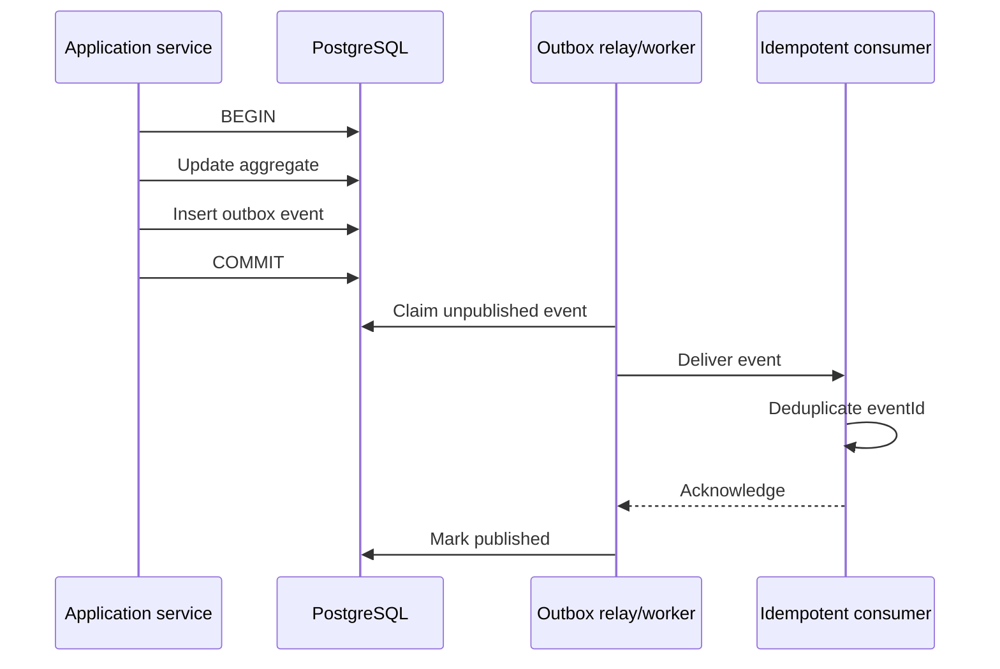
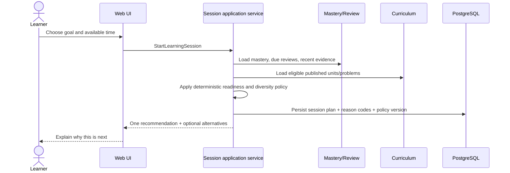
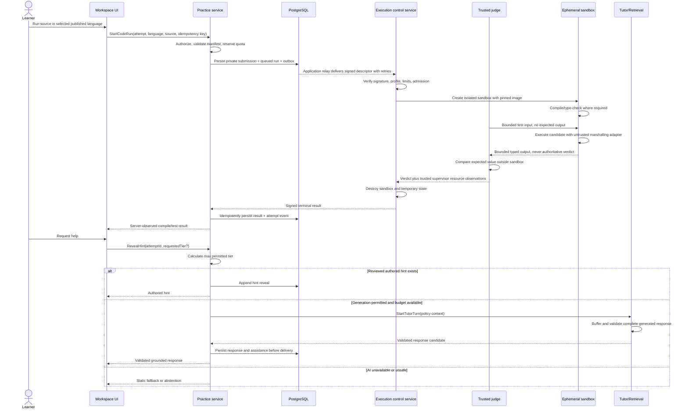
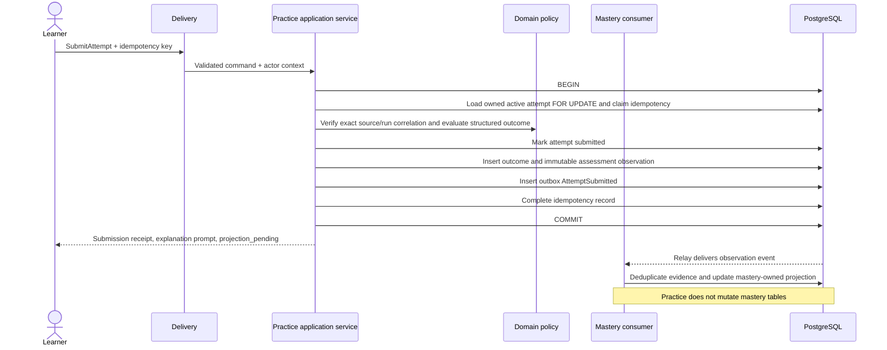
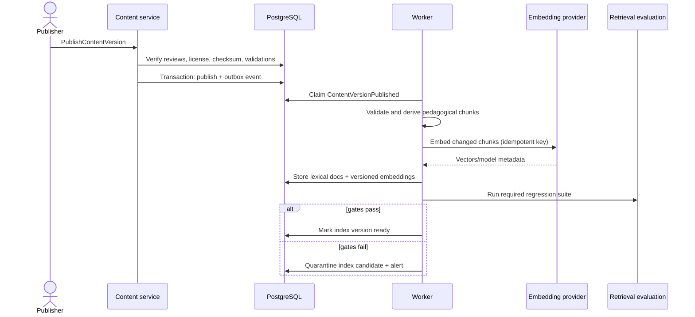
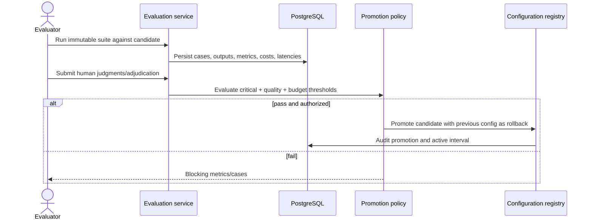

# Interfaces and runtime flows

**Status:** Proposed  
**Purpose:** Define collaboration boundaries without prematurely committing to public endpoint details

## 1. Interface principles

1. Commands express intent and may change state; queries return read models and do not change state.
2. Every command receives an authenticated actor context and performs resource authorization.
3. External side effects are idempotent and observable.
4. Public/browser contracts are schema-validated and versioned.
5. Internal module contracts use domain IDs and values, not ORM records or provider SDK types.
6. Events report completed facts in past tense; they do not act as disguised commands.
7. Sensitive fields require explicit opt-in at each boundary.
8. A trace/request ID follows every synchronous and asynchronous flow.

## 2. Delivery surfaces

| Surface | Use | Do not use for |
|---|---|---|
| Server-rendered components | Initial authenticated reads and page composition | Business writes or hidden authorization assumptions |
| Server Actions | Authenticated UI mutations tied to the web client | Stable third-party/public APIs or long-running work |
| Route Handlers | JSON endpoints, tutor streaming, webhooks, health/readiness | Unbounded jobs or arbitrary code execution |
| Background jobs | Derivation, embedding, evaluation, retention, reconciliation | User-facing synchronous decisions |
| Isolated execution control API | Authenticated dispatch/status/cancellation for Python, JavaScript, TypeScript, Java, C++, and C | Browser-direct access, arbitrary commands/images/flags/mounts/network settings |
| Ephemeral sandbox runtime | Compile and execute a server-owned run descriptor under strict isolation | Application/database credentials, durable product state, cross-run filesystem, network egress |

## 3. Actor and request context

All application use cases receive a context equivalent to:

```ts
type RequestContext = {
  requestId: string;
  traceId: string;
  actor: {
    userId: string;
    roles: string[];
    scopes: string[];
    sessionId: string;
  };
  locale: string;
  timezone: string;
  now: string;
};
```

`now` is supplied by a clock port for deterministic tests. Roles and scopes are revalidated server-side; they are not trusted from browser-submitted fields.

## 4. Command catalog

### Identity/profile

| Command | Result | Important invariants |
|---|---|---|
| `CompleteOnboarding` | Learner profile/version | Valid goals/time budget; consent version recorded |
| `UpdateLearnerPreferences` | Updated profile/version | Ownership; accessibility preferences preserved |
| `RequestAccountExport` | Export request ID | Idempotent; ownership; rate limited |
| `RequestAccountDeletion` | Deletion workflow ID | Re-authentication; grace/hold policy |

### Roadmap planning

| Command | Result | Important invariants |
|---|---|---|
| `CreateRoadmapPlan` | Draft plan ID | Horizon is 1/2/3/4/6 months; capacity and target date are valid |
| `ProposeRoadmapSchedule` | AI proposal + lineage | Proposal is bounded by learner intent; no publication or progress mutation |
| `ValidateRoadmapSchedule` | Validation report | Prerequisites, workload, review spacing, language availability, and buffers pass deterministic policy |
| `AcceptRoadmapPlan` | Active accepted version | Explicit learner acceptance; valid candidate; atomic expected-active-version check; immutable schedule |
| `ReplanRoadmap` | New draft/version | Historical plan adherence remains immutable |

### Curriculum/content

| Command | Result | Important invariants |
|---|---|---|
| `CreateContentDraft` | Stable ID + draft version | Author role; provenance started |
| `SubmitContentForReview` | Review workflow state | Schema/license/test completeness |
| `RecordContentReview` | Review record | Reviewer role; cannot mutate payload |
| `PublishContentVersion` | Published version + outbox event | All reviews/checks pass; immutable checksum |
| `RetireContentVersion` | Retirement record | Publisher role; reason; active indexes updated asynchronously |

### Practice/mastery

| Command | Result | Important invariants |
|---|---|---|
| `StartLearningSession` | Session plan | One active plan per request; recommendation reasons stored |
| `StartAttempt` | Attempt snapshot | Exact problem/policy versions pinned |
| `RecordAttemptEvent` | Event receipt | Owned active attempt; event type/schema valid |
| `SaveDraft` | Draft revision | Owned draft; optimistic revision; replaceable TTL-bound snapshot |
| `SaveArtifactRevision` | Immutable revision receipt | Explicit learner save; idempotent; bounded retained revisions |
| `RevealHint` | Hint content/reference | Tier ceiling enforced; assistance committed before delivery |
| `SubmitAttempt` | Submission receipt + projection status | Atomic outcome/observation/outbox; mastery-owned consumer derives evidence; exact source/run match |
| `CompleteReview` | Review result + next due window | Scheduled item ownership; evidence dedupe |
| `OpenExternalPractice` | Handoff receipt + provider URL | Reviewed link; readiness gate or owner-approved explicit practice-mode bypass; no provider credentials |
| `ConfirmExternalPractice` | Learner journal receipt | Explicit user action; labelled self-reported; no provider verification claim |
| `CorrectExternalJournal` | Append-only reversal receipt | Ownership; no deletion of prior history; metrics reconciled |

### Code execution

| Command | Result | Important invariants |
|---|---|---|
| `StartCodeRun` | Run ID and queued/running status | Owned active attempt; published language manifest; quota reserved; server constructs descriptor |
| `CancelCodeRun` | Cancellation receipt | Owned nonterminal run; best-effort sandbox termination; terminal result wins races deterministically |
| `RecordExecutionResult` | Accepted terminal result | Internal authenticated caller; signature/correlation verified; idempotent; immutable result |
| `DisableRuntimeProfile` | Disabled profile version | Privileged operator; audit reason; blocks new runs but preserves historical resolution |

### Tutor

| Command | Result | Important invariants |
|---|---|---|
| `StartTutorTurn` | Stream handle/turn ID | Budget, rate, privacy, mode, hint policy verified |
| `CancelTutorTurn` | Terminal state | Owned turn; provider cancellation best effort |
| `RecordTutorFeedback` | Receipt | Owned completed response; feedback is not truth label |

### Operations

| Command | Result | Important invariants |
|---|---|---|
| `RunEvaluationSuite` | Run ID | Immutable suite/config; budget reservation |
| `PromoteAiConfiguration` | Promotion record | Required gates and rollback config exist |
| `ChangeFeatureFlag` | Flag version | Scoped operator; audit reason |
| `ReplayFailedJob` | New attempt ID | Operator scope; original idempotency preserved |

## 5. Query catalog

- `GetLearnerHome`: next recommended action, alternatives, due reviews, and reason codes.
- `GetRoadmapPlan`: active plan version, horizon, daily/weekly items, capacity, validation status, and replan options.
- `GetCurriculumPath`: small learner-relative path, not the entire graph by default.
- `GetLearningUnit`: exact published content version and active checkpoints.
- `GetProblemWorkspace`: problem version, allowed tests, visualization contract, attempt state.
- `GetLanguageAvailability`: published language manifests and current runtime availability for a problem version.
- `GetCodeRun`: owned run status, normalized compile diagnostics, bounded output, and test outcomes.
- `GetAttemptHistory`: user-owned paginated summaries.
- `GetExternalPracticeJournal`: outbound handoffs and learner-confirmed statuses, clearly separated from AlgoCove execution evidence.
- `GetMasteryView`: projections, evidence summary, uncertainty, and next review.
- `SearchPublishedContent`: policy-filtered author/learner search.
- `GetContentReviewQueue`: role-scoped drafts and blocking checks.
- `GetEvaluationComparison`: configuration deltas with metric boundaries.
- `GetOperationalHealth`: redacted dependency and queue state.

Read models may denormalize data but carry an `asOf` time and relevant version IDs.

## 6. Error contract

Transport errors use a stable envelope:

```json
{
  "type": "https://algocove.dev/problems/hint-tier-not-allowed",
  "title": "Hint tier is not allowed",
  "status": 409,
  "code": "HINT_TIER_NOT_ALLOWED",
  "detail": "The current attempt permits hints through tier 2.",
  "instance": "req_...",
  "retryable": false,
  "fields": [],
  "traceId": "trace_..."
}
```

Error categories:

| Category | HTTP tendency | Retry behavior |
|---|---:|---|
| Validation | 400/422 | Fix input; do not retry unchanged |
| Authentication | 401 | Re-authenticate |
| Authorization/not found | 403/404 | Do not retry without changed permission |
| Conflict/version | 409 | Refresh state or reuse completed idempotent result |
| Rate/budget | 429 | Respect bounded retry-after or use fallback |
| Dependency unavailable | 502/503/504 | Bounded retry for idempotent operations; degrade |
| Internal invariant | 500 | Do not expose internals; alert with trace ID |

Do not return provider error bodies, prompts, SQL details, stack traces, secrets, or cross-user existence information.

## 7. Idempotency

Required for:

- attempt submission, draft saves, explicit artifact revisions;
- roadmap candidate acceptance with expected active version;
- external handoff requests, manual completion and journal corrections;
- code-run creation, dispatch, terminal-result ingestion, and cancellation;
- hint reveal when a retry could double-record assistance;
- content publication/retirement;
- embedding and evaluation jobs;
- provider-backed generation requests where safe;
- account export/deletion;
- webhook processing;
- notifications and analytics export.

An idempotency record includes scope, actor, operation, key, normalized request hash, state, result reference, and expiry. Reusing a key with a different request hash is a conflict. A concurrent duplicate observes the in-progress state or the completed result.

## 8. Domain-event catalog

| Event | Producer | Consumers | Contains |
|---|---|---|---|
| `RoadmapPlanAccepted` | roadmap-planning | home/progress, audit | Candidate/version IDs, policy and active-version token |
| `ExternalHandoffRequested` | practice-assessment | follow-through, audit | Reviewed reference version, journal ID; not navigation proof |
| `ExternalJournalRevised` | practice-assessment | follow-through | Reversal/replacement event IDs and learner-reported status |
| `ContentVersionPublished` | curriculum-content | indexing, audit | Content/version IDs, checksum, provenance reference |
| `ContentVersionRetired` | curriculum-content | indexing, recommendations | IDs, effective time, reason code |
| `AttemptSubmitted` | practice-assessment | mastery, analytics | IDs, outcome category, assistance summary; no raw code |
| `CodeRunQueued` | practice-assessment | execution control | Run ID, signed descriptor reference, language/runtime/limits versions; no reusable credentials |
| `CodeRunCompleted` | code-execution | practice, analytics | Run ID, terminal category, test summary, resource summary, signed result reference; no raw source |
| `CodeRunFailed` | code-execution | practice, reliability analytics | Run ID, learner-failure or infrastructure-failure category, language/runtime version |
| `HintRevealed` | practice-assessment | mastery, analytics | Attempt ID, tier, content version |
| `MasteryProjectionUpdated` | mastery-review | recommendation, analytics | Learner/concept IDs, band, policy version |
| `ReviewBecameDue` | mastery-review | notifications/home view | Learner/review IDs, due window |
| `TutorTurnCompleted` | tutor-retrieval | analytics, budget | Turn/config IDs, outcome, latency, token/cost summary |
| `TutorTurnFailed` | tutor-retrieval | reliability analytics | Stable error category and fallback result |
| `EvaluationRunCompleted` | evaluation | promotion workflow | Suite/config/run IDs and gate summary |
| `AccountDeletionRequested` | identity-profile | retention coordinator | User ID, workflow ID, effective policy |

Events carry `eventId`, `eventType`, `schemaVersion`, `occurredAt`, `producer`, `traceId`, `aggregateId`, and payload. Consumers must deduplicate by event ID.

## 9. Transactional outbox



Delivery is at-least-once. Exactly-once business effect comes from consumer idempotency and database constraints, not transport promises.

## 10. Core runtime flow — recommended learning session



If mastery data is absent, the system uses an explicit cold-start policy: diagnostic/intro content, never fabricated personalization.

## 10a. Core runtime flow — timeboxed roadmap and external handoff

```mermaid
sequenceDiagram
    actor L as Learner
    participant UI as Web UI
    participant R as Roadmap service
    participant Practice as Practice service
    participant C as Curriculum
    participant M as Mastery/Review
    participant DB as PostgreSQL
    participant P as External provider site

    L->>UI: Choose horizon, capacity, languages, goal, collections
    UI->>R: CreateRoadmapPlan
    R->>C: Load eligible internal units and external references
    R->>M: Load prerequisites, mastery, due reviews
    R->>R: AI proposes; deterministic validator checks schedule
    R->>DB: Persist validated candidate and reason codes
    R-->>UI: Preview scope, workload and schedule changes
    L->>UI: Accept candidate
    UI->>R: AcceptRoadmapPlan with expected active version
    R->>DB: Atomically activate immutable accepted version
    R-->>UI: Active daily/weekly schedule
    L->>UI: Complete internal learning, pseudocode, visualization, and attempt gate
    UI->>Practice: OpenExternalPractice
    Practice->>DB: Record handoff_requested
    Practice-->>UI: Reviewed canonical provider URL
    UI->>P: Learner solves directly on provider site
    L->>UI: Optional explicit confirmation
    UI->>Practice: ConfirmExternalPractice
    Practice->>DB: Append self-reported journal event
```

There is no provider callback, scraping, automatic submission, account synchronization, or claim of provider-verified completion in this flow.

## 11. Core runtime flow — multi-language code run and hint



Assistance is recorded conservatively before any authored or generated answer is delivered. Delivery failure does not erase exposure; retries return the same persisted response. Raw provider fragments never reach the learner. Restricted tiers use reviewed authored hints.

If compilation/execution infrastructure fails, the result is shown as an infrastructure failure and produces no negative mastery evidence. Timeout, memory, output, and process-limit outcomes are learner-run outcomes only when the sandbox infrastructure itself remained healthy.

## 12. Core runtime flow — attempt submission



## 13. Core runtime flow — tutor retrieval and streaming

```mermaid
sequenceDiagram
    actor L as Learner
    participant API as Streaming handler
    participant Policy as Tutor policy
    participant R as Retrieval service
    participant PG as PostgreSQL/pgvector
    participant AI as Model gateway
    participant V as Response validator
    participant Practice as Practice application service

    L->>API: Tutor request
    API->>Policy: Authorize mode, privacy, budget, tier
    Policy->>R: Retrieval query + mandatory filters
    par lexical
      R->>PG: Full-text candidates
    and dense
      R->>PG: Exact vector candidates
    end
    R->>R: Fuse, deduplicate, check contradictions
    R-->>Policy: Immutable evidence package
    alt evidence sufficient
      Policy->>AI: Policy + evidence + minimized context
      API-->>L: Pending status only
      AI-->>V: Complete buffered structured candidate
      V->>V: Schema, citation, tier, leakage checks
      alt valid
        V->>Practice: Validated response with evidence/tier
        Practice->>PG: Recheck current rights; persist response and assistance
        Practice-->>API: Persisted safe response
        API-->>L: Display validated answer
      else invalid
        V-->>API: Discard candidate; return authored fallback or abstention
      end
    else insufficient evidence
      Policy-->>API: Abstention or authored fallback
    end
```

The UI distinguishes pending, cancelled, fallback, and validated answers. No invalid text is shown and then retracted. Fallback hint delivery also persists its assistance before display. Free-form prose feedback remains advisory, not deterministic mastery evidence.

## 14. Core runtime flow — content publication and indexing



Publication and search eligibility are distinct. A published item with failed derivation is visible to direct authored experiences only if those experiences can safely render it; it is not eligible for tutor retrieval until the index is ready.

## 15. Core runtime flow — configuration promotion



## 16. API versioning and compatibility

- Browser-facing contracts are versioned by schema and changed additively within a supported version.
- Public APIs, if later introduced, use an explicit version namespace and published deprecation policy.
- Event schemas are backward-compatible for existing consumers; breaking changes create a new event version.
- Database migrations follow expand/migrate/contract: add new shape, backfill/release compatible code, then remove old shape in a later reviewed change.
- Content, curriculum, trace, policy, prompt, model, embedding, retrieval, and evaluation versions are independent and must not be collapsed into one ambiguous “app version.”

## 17. Pagination, time, and identifiers

- Use opaque, non-sequential external IDs.
- Use cursor pagination for ordered activity/content lists; stable tie-breaker is required.
- Store instants in UTC; keep original timezone where calendar semantics matter.
- Server-controlled timestamps determine authorization, deadlines, budgets, and evidence ordering.
- Money/cost uses integer minor units or exact decimal, never binary float.
- Durations and token counts are explicit units.

## 18. Interface acceptance criteria

- Every write path has actor context, authorization, validation, transaction boundary, stable error, audit/telemetry, and idempotency decision.
- Cross-context workflows use explicit services/events rather than table mutation.
- Partial tutor streams, failed jobs, and duplicate commands have defined terminal behavior.
- Events contain no raw learner code or conversation by default.
- Historical results can resolve all relevant content and policy versions.
- The fixed-hint fallback preserves the learning flow when model providers fail.
