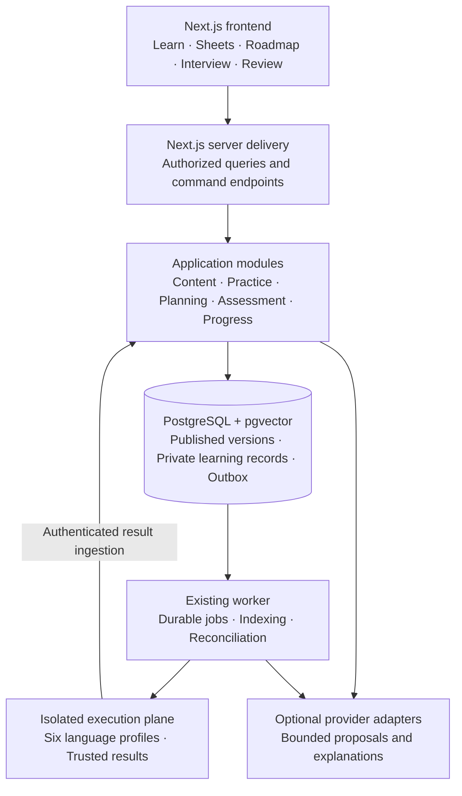
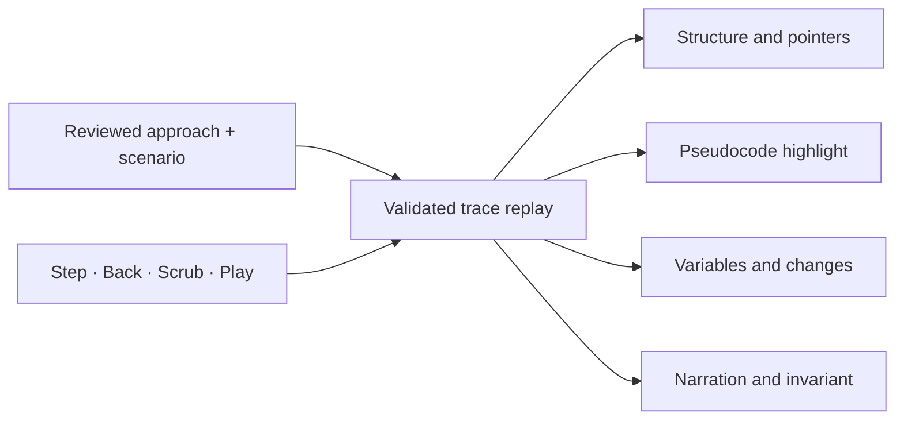

# AlgoCove architecture evolution proposal

Date: 2026-10-07
Status: PROPOSED; architecture analysis only. No implementation, migration, provider activation or deployment is authorized by this document.
Related: [Feature comparison](chai-prep-comparison-2026-10-07.md).

## 1. Recommended architecture

Evolve the existing modular monolith into a platform where a shared published curriculum powers Learn DSA, Sheets, Roadmap, Interview Prep, Reviews and Progress. Keep the existing Next.js/React frontend and backend delivery layer, TypeScript application/domain modules, PostgreSQL with pgvector, worker and isolated execution plane.

This is the recommended fit for AlgoCove's current code and scope. The public reference website does not establish its private backend stack or service topology. Similar frontend behavior can be implemented with AlgoCove's current stack.

Verified pins in `apps/web/package.json`: Next.js 16.3.6, React 19.3.0, Clerk Next.js 7.9.4. This proposal does not require a dependency upgrade. Official framework documentation was checked for architectural patterns; its latest-version selector may be newer than the repository pins.



Browser-side trace playback is deterministic presentation. Browser commands cannot directly write mastery or access the execution host. Execution dispatch/result paths retain their existing authenticated contracts; the diagram shows responsibility boundaries rather than replacing those protocols.

## 2. Changes with the highest value

| Priority | Change | Why it is needed |
| --- | --- | --- |
| First | Resolve published content by identity and slug | The learner page and API catalog currently admit one fixed problem |
| First | Add typed lesson and walkthrough assets | Current `content_item.content_kind` accepts only `problem`; broader conceptual types in design documents are not a complete implementation |
| First | Move problem-specific facts and checks out of JSX | Current container-area facts, questions and calculations cannot correctly serve unrelated problems |
| First | Separate destination provider from collection identity | Current provider values conflate sites and named lists |
| Next | Deliver shared catalog queries for courses, sheets and plans | Prevents each page from inventing its own availability and progress rules |
| Next | Synchronize authored pseudocode and trace state | Enables the central teaching interaction observed in the reference |
| Later | Add DSA interview session orchestration | Reuses eligible problems and execution while adding timed-assessment rules |

## 3. Frontend composition

Keep one application shell and the existing design tokens. Add learner entry points for `/learn`, topic/pattern pages, `/sheets` and sheet detail pages. Retain `/plan`, `/review`, `/progress` and current problem links. Introduce interview routes only when the feature exists. Avoid renaming the current problem route as part of unrelated visual work; retain its existing slug as an alias during migration.

Render catalog and lesson reads on the server through authorized application queries. Use client components for the code editor, drafts, trace controls, prediction input and session clock. This division follows Next.js's documented server/client responsibilities. [Next.js guidance](https://nextjs.org/docs/app/getting-started/server-and-client-components).

Server components should call those application queries directly; browser interactions use route handlers that call the same use cases. This avoids an internal HTTP round trip during server rendering. Every entry still enforces its visibility/ownership policy. [Next.js backend-for-frontend guidance](https://nextjs.org/docs/app/guides/backend-for-frontend).

Split `problem-workspace.tsx` into focused components backed by one workspace controller:

- `ProblemBrief`: statement, examples, constraints and objective.
- `ReasoningPanel`: learner plan, structured checks and saved revisions.
- `WalkthroughPanel`: approach/scenario selector, trace stage, pseudocode, variables and narration.
- `ImplementationPanel`: language, source, run/submit and diagnostics.
- `GuidancePanel`: hints and tutor delivery.
- `EvidencePanel`: readiness and external handoff.

These names describe proposed responsibilities, not a demand to create six new packages. Separate server state, unsaved learner drafts and transient display state. Changing a camera angle must not mutate an attempt; late responses must not overwrite a newer problem/language session. Preserve the existing revision conflict and recovery behavior.

A reducer is a suitable mechanism for coordinated display transitions such as selecting a scenario, moving a trace step and resetting playback. It does not replace server authorization or persisted attempt state. [React reducer guidance](https://react.dev/learn/extracting-state-logic-into-a-reducer).

The desktop learning surface should keep the visual stage, active pseudocode and state explanation close together. Use a focused stage selector to expose reasoning or coding without losing the learner's draft. On narrow screens, provide the same actions through labelled tabs with a text-equivalent trace. Maintain AlgoCove's existing spatial and flat options.

## 4. Shared published content contract

Extend the existing content lifecycle rather than creating a second catalog beside it. A published exercise should resolve to one immutable release manifest containing exact references to its problem version, lesson assets, language manifests, approaches, pseudocode, trace scenarios, hints, assessment rubric, external mappings and review/transfer assets.

The release manifest is a proposed aggregate contract. It should reference reviewed assets rather than duplicate their contents. New attempt creation pins the release and its constituent versions. Existing attempts retain their current IDs and remain readable. Publication checks compatibility; retirement/rights withdrawal remains an independent access restriction on pinned content.

| Object | Reuse or extension | Required contract |
| --- | --- | --- |
| Concepts and prerequisite graph | Reuse current learning records | Versioned, acyclic required edges |
| Problem identity/version | Reuse | Stable identity, exact attempt version, published slug lookup |
| Concept/pattern lesson | New typed content support | Objectives, prerequisites, authored blocks and checks |
| Algorithm approach | New versioned asset | Strategy, complexity, pseudocode line IDs and supported scenarios |
| Walkthrough scenario | New versioned asset | Bounded input, trace schema, deterministic replay and narration |
| Language manifest | Reuse | Actual reviewed starter/harness/runtime/fixture support |
| Sheet and sections | Extend collection capability | Ordered references, provenance and declared coverage |
| External destination | Refine current reference model | Destination platform, canonical problem identity and reviewed URL |
| Interview template/session | New feature | Exact problem/rubric versions, assistance policy and authoritative timing |

Store relationships, identity, lifecycle and ownership in relational tables. Use bounded, schema-validated JSONB for typed lesson blocks and trace payloads where structure varies. Use foreign keys and uniqueness for relationships and identity; validate graph cycles and cross-asset semantics during publication transactions. PostgreSQL's constraint mechanisms support the relational portion. [PostgreSQL constraints](https://www.postgresql.org/docs/17/ddl-constraints.html).

The initial lesson block set can be small: prose, example, code/pseudocode reference, diagram/trace reference and checkpoint. Avoid storing executable component code or arbitrary JavaScript expressions as lesson content. New types must be admitted deliberately in publication and retrieval; existing statement/hint indexing must not silently treat all new blocks as tutor-safe material.

## 5. Provider and sheet identity

Current evidence: `packages/domain/src/external-practice.ts` defines provider values including `blind`, `neetcode`, `top_interview_150`, `grind_75` and `striver_a2z`. Migration 0008 restricts each value to a particular host and deduplicates by `(provider, external_key)`.

Proposed concepts:

```text
Destination platform: LeetCode
External problem: platform + canonical problem identity
Curated collection: named list + curator + version + provenance
Collection membership: collection version -> external problem
Internal mapping: internal problem version -> external problem + relationship type
```

The same LeetCode problem can then belong to multiple collections without duplicating its external identity. Internal learning evidence remains attached to internal attempts; external completion remains learner-reported. Collection membership does not establish equivalent content or grant readiness.

Migration must preserve legacy reference IDs and journals. Introduce reviewed identity mappings, distinguish source-list pages from solve destinations, reconcile ambiguous entries manually, and update domain validation, database allowlists, publication controls and tests together. Do not bulk relabel every existing reference as LeetCode. Only retire old representation paths after all consumers have migrated.

## 6. Trace and pseudocode contract

Keep the deterministic replay model. Extend it in a reviewed schema version with an approach ID, scenario ID, stable step IDs, active pseudocode line IDs, structure-specific state, named variables, narration and checkpoint references. Read existing version-one traces during transition; do not rewrite historical attempt evidence.



Use a small renderer registry keyed by supported structure kind. Each renderer consumes validated state. Calculation annotations must belong to the algorithm/scenario or a reviewed calculation function; the generic array renderer must not always calculate container area.

Start with the current array/two-pointer case. Add hashing, window and stack states for the planned bundles. Trees, recursion, graphs and DP require distinct semantic state and accessible transcripts. A single universal animation engine is not required before those batches.

A checkpoint has a public prompt and a server-owned answer/rubric. Revealing the reference trace follows the existing assistance policy; a public payload must not accidentally include a restricted reference solution or checkpoint answer. Authored reference playback and actual learner execution remain separately labelled. Schema-valid learner edits do not establish algorithm correctness.

## 7. Backend modules and delivery contracts

Retain the current domain/application/adapter dependency direction. Add capabilities inside existing packages initially:

| Owner | New or refined responsibility |
| --- | --- |
| Curriculum/content | Published slug resolution, lessons, approach/scenario releases and catalog availability |
| Collections | Sheet sections, membership, source provenance and coverage queries |
| Practice/assessment | Compose the release into an attempt, serve allowed assets, grade authored checks |
| Planning | Query eligible catalog items instead of a fixed problem ID |
| Mastery/review | Reuse observations and projections across every entry point |
| Interview | Future template/session timing and debrief orchestration through practice commands |

Proposed query contracts: `ListPublishedTopics`, `ListPublishedProblems`, `GetLesson`, `GetSheet`, `GetProblemWorkspace` and `GetEligiblePlanningCatalog`. Return explicit view models with stable IDs, versions, available actions and reason codes. Paginate lists with bounded filters and stable ordering. The availability calculation must be shared so a sheet cannot promise an asset the workspace refuses.

Existing mutation endpoints continue to call existing use cases. Any new attempt, assessment, handoff or interview command needs actor ownership, validated inputs, the existing error envelope, payload-bound idempotency, expected-version conflict handling and an explicit pending/terminal response. Reuse current conventions rather than rename working endpoints for stylistic consistency.

Do not return database rows, private answer keys or provider payloads directly to the client. Public catalog reads and private learning overlays have different caching rules. Cache only explicitly public, allowed content; recheck current availability for start/reveal/run/handoff commands. Account for withdrawal in cache invalidation. Already delivered content cannot be made unseen through cache invalidation.

## 8. Authoring and operations

Extend the existing staff workflow to author a complete problem bundle and preview the exact learner experience. A release report should show missing language manifests, missing trace scenarios, invalid line references, absent transcripts and unresolved mappings before publication.

This is essential for scaling the catalog: each new problem should primarily add reviewed content and fixtures, with renderer code added only for genuinely new structures. Keep one authoritative publication workflow even if authors later use repository files or a richer editor.

Use the existing worker/outbox for indexing, long-running validation and reconciliation. Keep learner-visible publication and availability transactional; do not wait for embedding generation to make authored learning usable. Search discovery can begin with catalog filters and lexical search. Add vector retrieval only where semantic search or tutor evidence benefits from it.

Current PostgreSQL and application processes remain the baseline. Object storage becomes useful when authored media or trace artifacts exceed practical repository/database delivery budgets. Additional cache/queue infrastructure or service extraction should follow measured load, operational isolation or deployment needs. No such measurement was performed in this review.

## 9. Interview and roadmap behavior

The first interview extension should be a DSA rehearsal over reviewed eligible exercises. A session pins its template, problems, rubrics and assistance mode. The server records start/deadline and enforces expiry; the browser clock only displays remaining time. Define reconnect, late submission and outage behavior before implementing grading. Accepted results and debrief observations cite their exact source evidence.

Coached practice can reveal guidance according to policy. Timed rehearsal requires a distinct assistance policy and debrief timing. Reuse the isolated executor, drafts and assessment records; keep interview judgments separate from mastery unless the approved evidence policy explicitly admits them.

For roadmaps, replace the fixed problem lookup with eligible content queries, but preserve deterministic capacity/prerequisite validation and learner acceptance. Sheet overlap deduplicates required work while preserving collection attribution. Due reviews consume capacity. AI sequencing remains optional and cannot create unsupported learning assets.

Recommended plan amendment: allow curriculum work to proceed with authored/off AI after the required local learning and content gates are met, if the owner approves separating optional live-provider activation from Phase 10 entry. This resolves the tension between optional AI in the architecture and the current sequential activation gate. The amendment is proposed, not applied; current authorizations still govern implementation.

## 10. Migration and acceptance sequence

| Slice | Deliverable | Reviewable acceptance condition |
| --- | --- | --- |
| 1 | Content and identity contracts, draft ADRs, gate reconciliation | Published lookup, release pins, provider/collection migration and schema compatibility agreed |
| 2 | Remove fixed problem assumptions using the pilot and a distinct test-only fixture | Both resolve with their own facts, rubric and trace; existing drafts/attempts survive; new curriculum still requires publication review |
| 3 | Synchronized walkthrough for a reviewed approach | Stepping/back/scrub agree across visualization, pseudocode, variables and transcript; no restricted data leaks |
| 4 | Planned four-pattern curriculum | Each bundle passes its declared six-language, pedagogy, trace and accessibility requirements |
| 5 | Learn catalog and one curated sheet | Both entry points reference the same supported content and consistent progress |
| 6 | Catalog-driven roadmap | Feasible plans use actual content; unavailable scope produces a reasoned response |
| 7 | Separately approved DSA interview feature | Session expiry/recovery, assistance policy and evidence-based debrief work end to end |

The sequence describes dependencies for proposed work, not permission to bypass the phase ledger. Do not mass-convert content or rewrite historical IDs. Use additive schema changes and a bounded compatibility adapter for the existing pilot; remove that adapter only after migrated consumers and recovery paths are demonstrated.

This documentation revision reconciles the architecture index with accepted local spatial presentation (ADR-0018), records the implemented local worker, and labels target-only content types explicitly. Historical evidence records remain unchanged. Tasks 45b–45e and 50a–50b stage the shared foundation and discovery work; proposed Phase 14 Tasks 61–64 cover DSA interviews. ADRs 0019–0022 remain Proposed.

Proposed architecture decisions should cover: (1) published learning release and catalog contracts, (2) destination versus collection identity, (3) synchronized trace/pseudocode contract, and (4) DSA interview boundaries. None is marked accepted by this proposal.

## 11. Evidence and validation scope

Reviewed current sources include the [single-problem catalog](../../apps/web/src/practice/problem-catalog.ts), [planning catalog](../../packages/db/src/planning-catalog.ts), [workspace](../../apps/web/src/components/practice/problem-workspace.tsx), [trace contract](../../packages/visualizer/src/index.ts), [content schema](../../packages/db/migrations/0006_content.sql), [external schema](../../packages/db/migrations/0008_external_references.sql), [content domain](../../packages/domain/src/content.ts), [external domain](../../packages/domain/src/external-practice.ts), [phase ledger](../../tasks/todo.md), [system design](system-design.md) and [data architecture](data-and-ai-architecture.md).

This proposal adds documentation only. No runtime performance, model quality, migration safety or newly implemented behavior was tested. Acceptance conditions above describe future implementation evidence. Existing local technical verification and outstanding live activation/phase approvals remain as recorded in the repository.

## 12. Complete website journeys and later extensions

The [journey contract](website-journeys-and-coverage.md) expands the architecture into route-by-route entry, completion, exit, error and recovery behavior. It is the proposed acceptance companion for Tasks 45f–45g, 50c, 59a–59b and 65–68, in addition to the foundation tasks above.

Private sheets reuse canonical references under learner ownership. Explicit sanitized share snapshots add a separate publication/revocation boundary (ADR-0023). Code review, LLD and system design use typed artifacts with distinct assessment rules under proposed Phase 15 (ADR-0024); Phase 14 remains DSA-only. All these capabilities remain planned. No service split, framework replacement or claim about the reference's private infrastructure is introduced.
