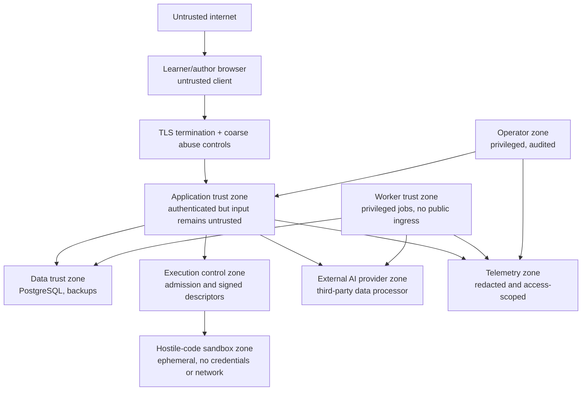

# Security, reliability, and operations architecture

**Status:** Proposed  
**Security posture:** Zero implicit trust across browser, application, code-execution, content, AI, worker, and operator boundaries  
**Reliability posture:** Preserve authored learning and state correctness before preserving AI convenience

## 1. Assurance objectives

AlgoCove must protect four things:

1. learner identity, code, progress, and conversations;
2. learning integrity, including hints, mastery evidence, and recommendations;
3. curated content rights, provenance, and publication integrity;
4. provider credentials, budgets, evaluation integrity, and operational control.

Security and reliability are enforced outside the LLM. Generated text is never trusted to authorize, publish, execute, score, or retain data.

## 2. Trust boundaries

Boundary rules:

- Browser claims, test outcomes, clocks, roles, and IDs are untrusted.
- Authenticated does not mean authorized.
- Published content is trusted only for provenance and review status, not as executable instructions.
- Retrieved content and model output remain untrusted data.
- Workers are more privileged than web requests and have no public ingress.
- Execution control accepts only internal authenticated descriptors; sandboxed learner code receives no application, database, queue, cloud-metadata, or provider access.
- Every learner run is a separate hostile workload even when submitted by an authenticated user.
- Telemetry is not a secondary private-data store.

## 3. Threat model

| Threat | Asset/impact | Prevent/detect/respond controls |
|---|---|---|
| Broken object-level authorization | Cross-learner data disclosure | Ownership/scoped-role checks in use cases; negative integration tests; opaque IDs; audit anomalies |
| Session theft/fixation | Account takeover | Secure HTTP-only same-site cookies; rotation; short privileged sessions; re-auth for sensitive actions |
| CSRF | Unauthorized mutations | Same-site cookies, origin checks, framework CSRF protections, no state change on GET |
| XSS through content/model output | Session/data theft | Render as text by default; strict sanitization; CSP; no unsafe HTML/eval; dependency scanning |
| SQL injection | Data breach/corruption | Parameterized SQL; allowlisted sort/filter fields; no model-authored SQL execution |
| Prompt injection in corpus/user input | Policy bypass/data exfiltration | Treat evidence as data; policy outside prompt; tool allowlist; output validation; adversarial evals |
| Tutor reveals full solution early | Learning harm | Deterministic tier ceiling; response leakage checks; authored fallback; audit sampling |
| Malicious learner code or compiler input | Host escape, cross-user data access, cryptomining, fork/resource bomb, egress attack | Separate execution plane; strong sandbox runtime/microVM class; one run per sandbox; network deny; read-only image; cgroup/host quotas; teardown and abuse monitoring |
| Forged or replayed execution result | False progress/mastery | Signed descriptors/results; internal service identity; run/attempt/user correlation; idempotent terminal state |
| Runtime-image supply-chain compromise | Escape or incorrect results across a language | Immutable digests, minimal images, SBOM/provenance, vulnerability/patch gate, conformance fixtures, controlled registry |
| Cross-run residue | Private code/test disclosure | Fresh sandbox and ephemeral volume per run; no shared writable caches; teardown reconciliation |
| Content supply-chain attack | Bad/injected teaching corpus | Provenance, checksums, reviews, immutable versions, quarantine, publish audit |
| Provider data leakage | Confidential code/conversations exposed | Minimize/redact payload; provider data policy; explicit operation consent; no secrets in prompts |
| Model/provider denial or cost attack | Availability/cost | Rate/budget limits, timeouts, circuit breaker, concurrency cap, static fallback |
| Privileged insider misuse | Private data/content corruption | Least privilege, scoped elevation, immutable audit, separation of duties, access review |
| Dependency/build compromise | Code execution/supply chain | Lockfiles, provenance/SBOM, vulnerability scanning, protected releases, secret scanning |
| Backup disclosure | Historical private-data breach | Encryption, separate credentials, restricted restore, tested expiry, access audit |
| Analytics re-identification | Privacy harm | Pseudonymous IDs, minimization, aggregation, access/retention controls, no raw code |

Threat modeling must be refreshed before the hosted pilot and whenever the sandbox technology, runtime image, language set, organization tenancy, minor-user policy, or AI provider changes.

## 4. Authentication and session architecture

- Prefer standards-based OIDC or verified email/magic-link through a maintained identity provider.
- Link identities to an internal opaque user ID.
- Use secure, HTTP-only, same-site cookies for browser sessions.
- Rotate sessions after authentication and privilege changes.
- Re-authenticate for account deletion, identity changes, privacy exports, and privileged publication/promotion.
- Support global session revocation and account suspension.
- Do not store OAuth access tokens unless a product integration requires them; encrypt and scope any retained token.
- MFA is required for privileged roles before production administration.

Exact identity vendor and session library are deferred to a later source-verified decision.

## 5. Authorization model

Authorization combines:

- role-based access for platform duties;
- resource ownership for learner data;
- scope for administrative domains or future organizations;
- state/policy checks for operations such as publish or reveal hint.

Every command performs authorization inside the application service. Database roles should reduce blast radius:

- web runtime cannot perform schema migrations or direct backup operations;
- worker can access only required job/data schemas;
- execution sandboxes have no database role or credentials; the execution control service uses only its internal scheduling/result channel and cannot query learner/application tables directly;
- migration role is separate and unavailable to normal runtime;
- analytics export has read access only to approved views;
- operator tooling uses short-lived scoped credentials.

If organization tenancy is later approved, add an explicit `organization_id` to tenant-owned aggregates, tenant-aware unique constraints, authorization tests, and optionally row-level security as defense in depth. Do not retrofit tenancy by trusting a request header.

## 6. Input, output, and browser security

- Schema-validate all route, action, webhook, job, and provider inputs.
- Enforce size, type, range, enumeration, and collection-count limits.
- Normalize Unicode and filenames where identity/comparison matters.
- Render authored/model Markdown through a restrictive sanitizer; disallow raw HTML by default.
- Use a strict Content Security Policy; no `unsafe-eval` in the application shell.
- Set secure headers: HSTS after HTTPS validation, frame protection, MIME sniffing protection, referrer policy, and restrictive permissions policy.
- Validate outbound URLs and do not allow arbitrary server-side fetches (SSRF).
- Use allowlisted redirect destinations.
- Scan file uploads if introduced; keep them outside executable paths and serve with safe content disposition.

## 7. Untrusted multi-language code execution

Isolation protects the host; it does not establish verdict integrity. Trusted judging and signing keys stay outside the candidate sandbox. The judge supplies inputs and compares bounded typed outputs; learner code or a harness in its address space cannot report authoritative pass/fail. Spoofed verdicts, malformed frames, debug-output injection, and expected-output exposure require negative tests. See [execution contracts](implementation-contracts.md#5-execution-and-judging).

Generated tutor output is untrusted until complete validation. Buffer it and persist assistance before delivery. Restricted hints remain authored; a semantic leakage classifier cannot guarantee zero leakage on arbitrary prose. Client payloads must not preload locked solutions, traces, or hidden tests. See [ADR-0014](../adr/0014-validate-before-display-and-trust-evidence.md).

### First-release boundary

Python, JavaScript, TypeScript, Java, C++, and C are first-class execution targets. Learner source and compiler inputs are hostile. They run only in a separately deployed execution plane; they never execute in the Next.js process, background worker, browser application origin, database host, or general application container.

The execution plane has three layers:

1. **Execution control:** verifies internal service identity and descriptor signature, enforces language/profile state, admission, quota, idempotency, and cancellation.
2. **Scheduler/host policy:** selects an eligible sandbox host, applies concurrency/cgroup/network policy, and tracks lifecycle without exposing host controls to the job.
3. **Ephemeral sandbox:** receives a server-owned manifest plus source/fixtures, compiles where necessary, runs tests, emits a bounded normalized result, and is destroyed.

The production boundary must use a strong sandboxed-container runtime such as a gVisor-class design, a microVM-class design, or a managed service with equivalent documented isolation. gVisor's security model explicitly notes that resource exhaustion still depends on host resource controls and networking requires container-level policy; Firecracker likewise treats guest code as malicious and requires host-level egress filtering. Therefore sandbox technology never replaces defense in depth. [gVisor security model](https://gvisor.dev/docs/architecture_guide/security/), [Firecracker design](https://github.com/firecracker-microvm/firecracker/blob/main/docs/design.md)

### Run-descriptor controls

- Learner-controlled fields are limited to source files and selection of an available published language.
- The server chooses entry point, compiler/runtime command, argument vector, environment allowlist, image digest, harness, fixtures, limits, and network mode from an immutable language/problem manifest.
- Commands are executed directly as an argument vector; no learner text is interpolated into a shell command.
- Paths are generated under a fresh job root; submitted filenames are normalized/allowlisted and cannot escape that root.
- The descriptor is signed, expires quickly, is bound to one run ID, and cannot be replayed with different source or limits.

### Sandbox controls

- one learner run per sandbox security boundary;
- no network interface/egress, including cloud metadata; enforce at sandbox and host/network-policy layers;
- no inbound listener;
- no host, Docker/container-runtime, database, queue, secret, service-account, or control-plane socket mounted;
- read-only minimal root image plus size-limited ephemeral workspace/tmpfs;
- non-root UID/GID, dropped capabilities, no privilege escalation, restricted syscall surface, and no host PID/IPC namespace;
- hard memory, CPU, wall-clock, PID/process/thread, file-size, open-file, disk, input, stdout, and stderr limits;
- bounded compile and run phases with independent deadlines;
- output captured as bytes, truncated safely, encoded for display, and never treated as HTML/commands;
- forced termination followed by sandbox, process, namespace, and volume teardown;
- orphan reconciliation and host quarantine when teardown or isolation verification fails.

Containers have no CPU or memory constraints by default, so explicit host-enforced limits are mandatory. Network must be explicitly disabled rather than assumed. [Docker resource constraints](https://docs.docker.com/engine/containers/resource_constraints/), [Docker none network driver](https://docs.docker.com/engine/network/drivers/none/)

### Runtime-image controls

- separate minimal, immutable images for Python; JavaScript/TypeScript; Java; and C/C++, or more separation where patch/compatibility needs require it;
- exact compiler/runtime/tool versions and image digest recorded on every run;
- TypeScript type-checks/transpiles under a pinned configuration before paired JavaScript execution;
- no package installation, arbitrary imports from the network, build scripts, or learner-selected compiler plugins;
- only an approved standard-library subset where the problem/runtime policy requires one;
- SBOM, build provenance, signature verification, vulnerability scanning, patch SLA, and retirement status;
- language conformance, malicious-input, and isolation regression suites before promotion;
- rollback to a previously approved digest without changing historical run records.

### Result integrity and limitations

The execution control service signs a terminal result containing run/attempt correlation, manifest and image versions, compile diagnostics, test outcomes, terminal category, bounded output, and resource summary. The application verifies it before creating attempt events or mastery evidence. Infrastructure failure never becomes learner failure.

This provides server-observed learning results, not proctored certification or proof of authorship. Hardware side channels and defects in the chosen sandbox/runtime remain residual risks; hosts and runtime images require patching, isolation monitoring, capacity headroom, and incident procedures.

## 8. AI and RAG safety controls

### Input controls

- Minimize learner context and redact likely secrets/PII.
- Label retrieved evidence and learner text as untrusted data.
- Enforce token/context limits before calling providers.
- Do not include application/system secrets, raw access tokens, or internal error traces.
- Route only to providers approved for the data classification and region.

### Policy controls

- Hint tier and solution permission are deterministic fields, not natural-language suggestions.
- Tools are allowlisted and argument-schema validated.
- The model has no direct database, publish, progress-update, or code-execution capability.
- Model output cannot produce new trusted citations; cited IDs must come from the evidence package.

### Output controls

- Validate structured response schema.
- Reject citation mismatches and tier violations.
- Detect likely full-solution leakage in restricted modes.
- Escape/sanitize before rendering.
- Mark partial/cancelled output as incomplete.
- Abstain/fallback when evidence or validation is insufficient.

### Evaluation controls

Maintain adversarial cases for instructions embedded in content, requests to reveal hidden prompts or solutions, fabricated citations, cross-user context requests, secret-shaped learner strings, ambiguous intent, contradictory content, and unsupported questions.

## 9. Secrets and key management

- Store secrets in a managed secret system for hosted environments, never source control or client bundles.
- Separate development, test, staging, and production credentials and databases.
- Scope provider keys by environment and capability where supported.
- Rotate keys on a schedule and immediately after suspected exposure.
- Log secret access metadata, never secret values.
- Use short-lived workload identity instead of static cloud keys where available.
- Prevent secrets from entering prompts, logs, traces, error bodies, build artifacts, and analytics.

## 10. Privacy architecture

### Data minimization

- Collect only profile attributes required for learning and operation.
- Avoid birth date unless age policy makes it necessary.
- Store final/saved code snapshots rather than every keystroke.
- Keep raw conversations only under a declared retention policy.
- Use pseudonymous identifiers in analytics.
- Default model/evaluation datasets to reviewed public content, not learner data.

### Purpose limitation

Learner data purposes are separated: product delivery, safety/reliability, product analytics, research/evaluation, and marketing. Consent or legal basis for one does not imply another. Product access must not depend on optional marketing/research consent.

### User rights

Architecture supports profile/data export, account deletion, consent withdrawal, and correction. Workflows are idempotent, auditable, and propagate to derived stores. Backups expire under policy rather than being selectively rewritten unless legally/technically required.

### Minors

Minor users are an unresolved scope decision. If supported, do not launch until age/consent, communication, analytics, content safety, retention, guardian rights, and jurisdiction-specific requirements are defined and reviewed.

## 11. Audit architecture

Audit events are required for:

- privileged login/elevation and role grants;
- content review, publish, retire, and rights changes;
- evaluation promotion and rollback;
- feature flags and budget changes;
- privacy exports, deletions, holds, and raw-data access;
- secret/config changes through operator systems;
- manual job replay or data correction.

Audit records include actor, action, resource, before/after references or safe diff, reason, timestamp, request/trace ID, and result. They are append-only to application users, access-controlled, retention-defined, and monitored for gaps. Raw secrets and unnecessary learner content are excluded.

## 12. Reliability model

### Critical user capabilities

| Capability | Dependency tolerance | Degraded behavior |
|---|---|---|
| View authored lesson/problem | Database required; AI not required | Serve cached immutable content where safe |
| Compile/run solution in any supported language | Application + execution plane required | Preserve source locally, show explicit service-unavailable state, allow retry; do not fabricate or client-self-report a passing result |
| Record attempt/progress | Database required | Preserve client state and offer bounded retry; never claim saved until committed |
| Reveal authored hint | Database required; AI not required | Serve reviewed fixed hint |
| Generate tutor explanation | Database + retrieval + provider | Fall back to authored hint/abstention; do not block attempt |
| Recommend next activity | Database required | Use conservative baseline/diagnostic if projection unavailable |
| Publish/index content | Database + worker/provider/eval | Remain unready/quarantined; never partially index |
| Admin/evaluation | May be unavailable without blocking learning | Pause promotion and notify operator |

### Failure rules

- Fail closed for authorization, content publication, hint policy, privacy, and configuration promotion.
- Fail open only for noncritical telemetry after buffering/dropping under policy.
- Never lose a committed learner attempt because analytics or notifications fail.
- Never mark generated output complete before validation/persistence.
- Never substitute a more permissive model/provider policy during fallback.

## 13. Proposed SLOs

These are targets for approval and later measurement, not achieved results.

| Service indicator | Proposed SLO | Measurement boundary |
|---|---:|---|
| Authenticated core page availability | 99.9% monthly | Successful non-maintenance requests excluding client/network errors |
| Attempt submission success | 99.95% monthly | Valid submissions committed within timeout |
| Attempt submission latency | P95 < 500 ms | Application ingress to committed response, excluding compilation/execution |
| Core content read latency | P95 < 400 ms | App ingress to first complete response under declared load |
| Retrieval latency | P95 < 300 ms | Valid retrieval request to evidence package, excluding generation |
| Tutor time to first validated answer | Target set after buffered-provider spike; not yet measured | Ingress through validation and persistence before learner-visible answer; status latency measured separately |
| Tutor completed-turn success | 99.0% monthly | Validated completed or explicit safe fallback; provider-only generation reported separately |
| Code-run service availability | 99.5% monthly proposed for pilot | Accepted execution requests that reach an explicit terminal result; reported per language profile |
| Code-run terminality | 99.9% of accepted runs reach a terminal state | Within profile deadline plus orchestration allowance; excludes user cancellation |
| Data-loss objective | RPO <= 5 min proposed | Hosted PostgreSQL committed state |
| Restore objective | RTO <= 60 min proposed | Service restored in pilot single region |

Separate SLOs prevent a static fallback from hiding poor provider availability. Error budgets should pause risky releases and trigger reliability work; they are not aspirational dashboards.

## 14. Timeouts, retries, circuit breakers, and load shedding

| Dependency/operation | Policy |
|---|---|
| Database | Short query/lock timeouts; retry only recognized transient serialization/connection errors with jitter |
| Generation provider | Explicit connect/first-token/overall deadlines; at most bounded fallback; cancellation propagated |
| Embedding provider | Durable idempotent job; exponential backoff with jitter; dead-letter after bounded attempts |
| Email/analytics | Asynchronous outbox; do not block core transaction |
| Webhook | Verify signature/timestamp; deduplicate; acknowledge only after safe persistence |
| Evaluation | Reserve budget; concurrency limit; resumable cases; no unbounded provider retries |
| Code execution | Idempotent dispatch; no automatic duplicate after execution begins; profile deadlines; cancellation/kill; reconcile unknown terminal state before retry |

Circuit breakers operate per provider/model/operation. Load shedding order:

1. pause offline evaluations and nonurgent embeddings;
2. reject abusive or over-quota execution and preserve already accepted runs;
3. reserve execution capacity for active learner attempts using fair per-user limits;
4. disable expensive optional reranking;
5. constrain generation length/concurrency;
6. route eligible tutor turns to tested fallback;
7. serve authored hints and abstentions;
8. preserve attempt writes and core content reads.

## 15. Backup, restore, and disaster recovery

### Backup design

- Managed database automated backups and point-in-time recovery for hosted pilot.
- Encrypted backups with credentials separated from runtime.
- Versioned immutable content assets in object storage when introduced.
- Infrastructure/configuration definitions and migrations under version control.
- Provider configuration versions stored without secret values.
- Backup retention aligns with privacy/deletion policy.

### Restore validation

A backup is not evidence until restored. Before production launch and on a schedule:

1. restore into an isolated environment;
2. verify schema/migration consistency;
3. reconcile counts/checksums for users, published content, attempts, evidence, citations, and outbox;
4. verify private access controls;
5. run critical learner and retrieval smoke tests;
6. measure actual RPO/RTO;
7. securely destroy the restoration environment.

### Single-region failure

The initial hosted architecture accepts a declared single-region availability risk. Multi-region active-active is deferred. Recovery prioritizes database correctness, web read/write service, authored learning, then AI/worker functions.

## 16. Observability architecture

### Correlation

Use `traceId`, `requestId`, authenticated pseudonymous `userId`, learning `sessionId`, `attemptId`, `tutorTurnId`, and `jobId` as applicable. IDs are attributes, not log-message text conventions.

### Structured logs

Log event name, time, severity, environment, service/module, trace/request IDs, operation, outcome, stable error category, duration, and safe resource IDs. Do not log raw code, prompts, conversations, emails, access tokens, cookies, full provider bodies, or SQL parameters by default.

### Metrics

#### Technical

- request rate/error/duration by operation;
- database pool/locks/slow-query distribution;
- tutor first-validated-answer/completion latency and terminal states; internal provider first-token latency separately;
- retrieval stage latency/candidate counts;
- worker queue age, attempts, failures, dead letters;
- execution admission rejects, queue age, sandbox startup, compile/run duration, terminal categories, CPU/memory/PID/output-limit kills, teardown failures, host quarantine, and active runs by language profile;
- provider request/error/token/cost by approved dimensions;
- content index readiness and reconciliation gaps;
- backup/restore age and last successful drill.

#### Learning/product

- recommended/accepted/started/completed session;
- hint tier and full-solution reveal;
- delayed review and transfer outcome;
- recommendation override/abandonment reason;
- visualization prediction, keyboard, and reduced-motion completion.

Learning telemetry is not operational logging and must pass consent, privacy, retention, and metric-definition review.

### Tracing

Trace browser/server request -> application command -> database/retrieval or execution dispatch -> provider/sandbox -> validation -> persistence. Execution traces contain IDs, profile versions, timings, and terminal categories, never raw source or unrestricted output. Sample ordinary success, retain errors/slow traces at a higher policy-controlled rate, and redact span attributes.

### Alerting

Alerts are symptom-based and actionable:

- attempt submission SLO burn;
- authorization-denial anomaly or cross-scope test failure;
- database saturation/replication/backup failure;
- tutor fallback/invalid-output/solution-leak spike;
- provider cost or token-budget anomaly;
- queue oldest-age and dead-letter growth;
- code-run queue/SLO burn, repeated sandbox limit violations, unexpected egress attempt, teardown/orphan failure, runtime-image critical vulnerability, and sandbox-host quarantine;
- retrieval benchmark or citation-quality regression on promotion;
- outbox/index reconciliation lag;
- no telemetry/heartbeat where one is expected.

Each production alert requires severity, owner, runbook, diagnostic links, and safe rollback/degradation action.

## 17. Cost architecture

- Reserve budgets atomically before costly model/evaluation work.
- Track estimated and reconciled cost per provider, model, operation, and pseudonymous learner/session.
- Enforce per-turn, per-day learner, environment, and global caps.
- Limit prompt/context/output tokens.
- Prefer authored content for common hints.
- Cache only with correct version/privacy keys.
- Stop or defer offline work when budget thresholds are crossed.
- Alert on cost per completed learning session, not only aggregate spend.
- Track sandbox CPU-seconds, memory-seconds, image transfer/startup, and cost per completed code run by language without high-cardinality source data.

Budget denial returns a clear authored fallback and stable reason; it must not appear as a generic server error.

## 18. Release and migration safety

- Environments are isolated; no production data in development.
- Releases are immutable and identify code/config/schema/content versions.
- Database changes use expand/migrate/contract.
- Destructive migrations require backup/restore evidence and explicit review.
- AI/retrieval changes use evaluation promotion and independently reversible flags.
- Content changes are immutable versions with retirement/rollback pointers.
- Worker consumers deploy backward-compatible with event versions.
- Execution control, descriptor/result schemas, runtime images, and sandbox-host policy are independently versioned and promoted through conformance/security gates.
- Rollback cannot assume a schema down-migration; forward-fix and compatible application rollback are preferred.

## 19. Incident readiness

Minimum runbooks before hosted pilot:

- database unavailable or saturated;
- provider outage/rate-limit/cost spike;
- suspected data exposure or account takeover;
- malicious or incorrect published content;
- prompt-injection or solution-leak regression;
- stuck/poisoned worker job;
- suspected sandbox escape, unexpected network/metadata access, cross-run residue, malicious compiler input, runaway host resource use, orphaned sandbox, or compromised runtime image;
- failed deployment or migration;
- backup/restore failure;
- privacy deletion/export failure.

Severity definitions, incident commander, communication channel, evidence preservation, containment, recovery, user-notification decision, and post-incident review must be named. Do not use private learner content in incident screenshots or tickets unless strictly necessary and access-controlled.

## 20. Security and reliability verification matrix

| Concern | Verification |
|---|---|
| Ownership/roles | Unit policy tests + integration negative tests for every resource operation |
| Session/CSRF/browser controls | Automated header/config tests + browser security review |
| XSS/model/content rendering | Sanitizer fixtures, CSP tests, adversarial payloads |
| SQL/SSRF/input validation | Static analysis, integration tests, allowlist tests |
| Hint leakage/prompt injection | Versioned adversarial evaluation with zero critical bypass target |
| Private data boundaries | Schema/serialization tests, log scanning, provider-payload fixtures |
| Multi-language sandbox | Escape/syscall, network/metadata, fork/thread bomb, memory/CPU/disk/output flood, path traversal, symlink, cross-run residue, signal/cancellation, and teardown fixtures across all six languages |
| Language correctness | Shared semantic fixtures, compile/runtime diagnostic normalization, runtime-image digest and harness-version assertions |
| Idempotency/outbox | Duplicate/concurrent/replay tests and reconciliation |
| Provider resilience | Timeout, malformed stream, mid-stream failure, rate-limit, outage fixtures |
| Backup/restore | Scheduled isolated restore with measured RPO/RTO |
| Accessibility | Keyboard, text equivalent, reduced motion, contrast, assistive-tech checks |
| Load/reliability | Declared workload tests and SLO instrumentation validation |
| Supply chain | Locked dependencies, secret scan, vulnerability scan, SBOM/provenance |

## 21. Pre-hosted-pilot gate

The architecture cannot be called production-ready until all are evidenced:

- identity/session implementation and privileged MFA reviewed;
- full authorization matrix tested;
- retention, deletion, privacy notice, and minor-user decision approved;
- provider data-processing and region policy approved;
- budgets/rate limits/circuit breakers configured and tested;
- critical adversarial tutor cases pass;
- every advertised problem-language combination passes semantic conformance;
- the execution plane passes isolation, resource, network-denial, result-signature, teardown, load, and runtime-image supply-chain gates;
- content provenance/review/publication controls pass;
- backup restore drill meets approved RPO/RTO;
- SLO dashboards and actionable alerts operate under load;
- incident runbooks and ownership exist;
- accessibility critical journeys pass;
- rollback for code, schema-compatible app, content, and AI configuration is demonstrated.

Until then, the correct status is `architecture proposed` or later `pilot under validation`, never `enterprise production-ready`.
