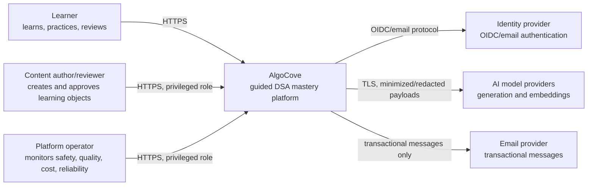
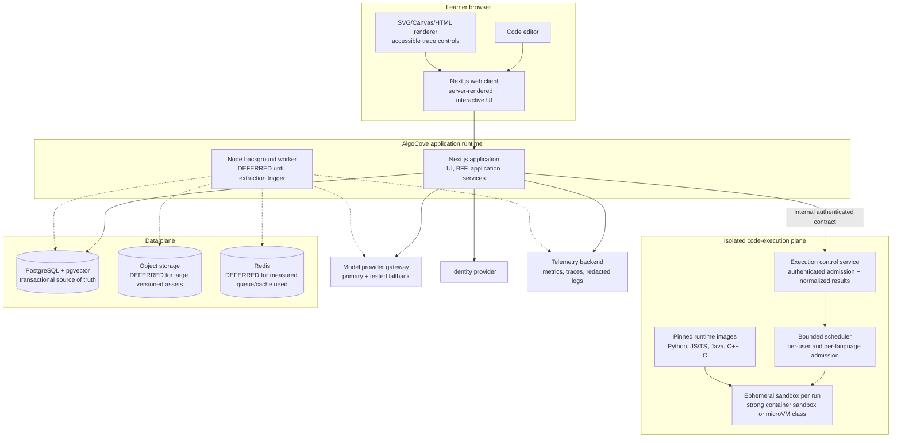
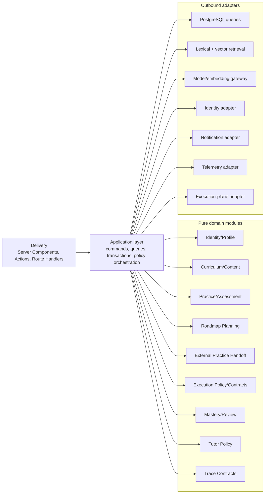
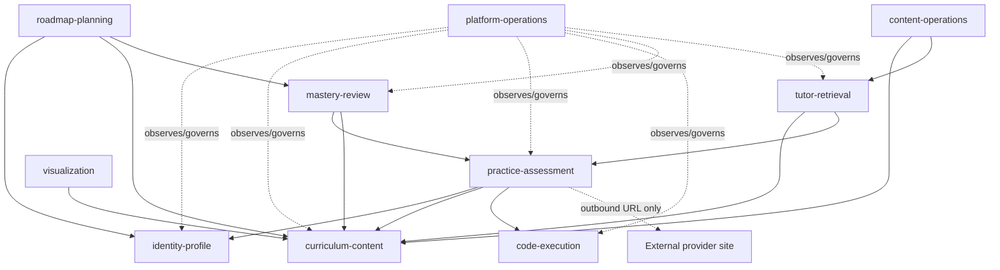

# AlgoCove system design

**Status:** Proposed  
**Gate:** A0-A2 pending  
**Architecture style:** Deployment-neutral modular-monolith core plus an isolated multi-language execution plane

## 1. System mission

AlgoCove is not a generic DSA chatbot or a large problem directory. It is an adaptive mastery system and outbound practice companion composed of six cooperating engines:

| Engine | Responsibility | Must remain deterministic? |
|---|---|---|
| Curriculum engine | Prerequisite graph, objectives, content applicability | Yes for graph and publication rules |
| Practice engine | Session assembly, problem selection, attempt lifecycle, hint ceiling | Yes |
| Visualization engine | Trace validation, active checkpoints, accessible state representation | Yes |
| Tutor RAG engine | Evidence retrieval and adaptive explanation | Retrieval is deterministic for a configuration; wording may be generative |
| Roadmap engine | Timeboxed 1/2/3/4/6-month plan proposal, validation, daily schedule, and replanning | Yes for constraints and published schedule; AI may propose |
| External practice handoff | Reviewed source links, readiness gate, outbound navigation, and learner-owned handoff journal | Yes; no provider synchronization |

The LLM is subordinate to these engines. It cannot publish content, change progress, raise its own hint tier, execute learner code, or invent mastery evidence.

The six product engines are supported by a separate security-critical platform capability: a language-neutral code-execution plane for Python, JavaScript, TypeScript, Java, C++, and C. It is outside the web-process trust boundary from the first hosted release.

## 2. Quality-attribute priorities

The order matters when trade-offs arise.

1. **Learning integrity:** avoid answer leakage and incorrect teaching.
2. **Security and privacy:** isolate untrusted code and private learner data.
3. **Correctness and auditability:** explain why content, a hint, or a recommendation was selected.
4. **Availability with graceful degradation:** authored learning works without AI.
5. **Accessibility:** equivalent operation without pointer-only controls, color, animation, or sound.
6. **Maintainability:** domain boundaries are visible and testable.
7. **Performance:** interactive paths are responsive under declared workloads.
8. **Cost efficiency:** generation and embedding spend is bounded per user and globally.
9. **Scalability:** scale measured bottlenecks without distributing the whole system.

## 3. C4 level 1 — system context



Third-party coding platforms are not upstream content systems. AlgoCove stores reviewed source links and opens them at the learner's request. It must not scrape, mirror, submit to, or automatically synchronize provider content, credentials, submissions, or profile counts.

## 4. Actors and authorization roles

| Role | Allowed responsibilities | Explicit prohibitions |
|---|---|---|
| Learner | Manage own profile; start sessions; submit attempts; request permitted hints; view own progress; request export/deletion | Cannot publish content, view another learner, change evidence, or access raw evaluation data |
| Author | Create draft content and preview derived chunks/traces | Cannot self-approve content unless explicitly granted reviewer separation for a small team |
| Technical reviewer | Validate algorithms, tests, complexity, and trace correctness | Cannot bypass license or pedagogical review |
| Pedagogical reviewer | Validate objectives, hint ladder, misconceptions, and accessibility | Cannot alter published versions without a new version |
| Publisher | Promote a fully reviewed version to published state | Cannot publish failed validation/evaluation artifacts |
| Evaluator | Manage benchmark cases and compare candidate configurations | Cannot promote a model/configuration without recorded results |
| Operator | View redacted operational telemetry, manage flags and provider health | Cannot inspect raw learner content by default |
| Privacy administrator | Fulfil exports, deletion, retention, and legal holds | Actions are audited and require scoped elevation |

Authentication establishes identity; application authorization verifies role, resource ownership, and action on every command. UI visibility is not an authorization control.

## 5. C4 level 2 — containers



### Container responsibilities

#### Web application

- Renders learner and administration experiences.
- Terminates authenticated requests and performs authorization.
- Executes synchronous commands and queries through application services.
- Delivers validated tutor responses over HTTP; pending generation emits status only.
- Does not perform long-running ingestion, offline evaluation, or arbitrary server-side code execution.

#### Isolated code-execution plane

- Accepts only authenticated, signed, schema-validated run descriptors from the application, never arbitrary shell commands.
- Supports Python, JavaScript, TypeScript, Java, C++, and C as separate pinned runtime profiles.
- Creates one disposable sandbox per run or per explicitly safe test batch; no learner workloads share a sandbox.
- Compiles TypeScript, Java, C++, and C inside the sandbox before execution; Python and JavaScript still pass syntax/preflight validation.
- Exposes an ephemeral writable workspace with submitted source and untrusted marshalling harness; expected outputs stay with the trusted judge outside the sandbox. Inputs are supplied in bounded frames; the root image is read-only.
- Disables network at the sandbox and host-policy layers and provides no application/database/cloud credentials.
- Enforces hard CPU, wall-time, memory, process/PID, filesystem, input, output, and concurrency limits.
- Runs as an unprivileged identity with dropped capabilities, syscall isolation, no host mounts, no container socket, and no privilege escalation.
- Normalizes compile diagnostics, test results, stdout/stderr truncation, timeout, memory limit, runtime error, and infrastructure failure into a language-neutral result contract.
- Destroys the sandbox and writable state after every terminal outcome; reconciliation cleans orphaned sandboxes.
- Uses a stronger isolation technology than a default shared-kernel container for hostile multi-tenant code. The exact gVisor-class sandbox, microVM-class sandbox, or managed execution platform remains an approval-gated infrastructure choice.

TypeScript is a first-class learner language, not merely an editor mode. Its profile performs a pinned type-check/transpile step and then executes the resulting JavaScript in the paired pinned runtime. JavaScript and TypeScript may share a base image, but their compiler diagnostics, language metadata, and content examples remain distinct.

#### PostgreSQL + pgvector

- Stores transactional state and immutable evidence records.
- Enforces foreign keys, uniqueness, lifecycle constraints, and optimistic concurrency.
- Provides lexical retrieval and vector similarity for the curated corpus.
- Does not become a generic event stream or unbounded log sink.

#### Background worker

Not deployed at the start. It is extracted when jobs exceed interactive request budgets, require durable retries, or compete with learner traffic. The first trigger is durable code-run dispatch in Task 21. It later handles content derivation, embeddings, offline evaluations, review-schedule batches, and retention jobs. A transactional outbox prevents lost work.

## 6. C4 level 3 — web application components



### Layering rules

- Domain modules contain no Next.js, database, provider SDK, network, or telemetry imports.
- Delivery code validates transport shape but delegates business validation and authorization.
- Application services define transaction boundaries and call domain policies.
- Adapters implement ports owned by the application/domain side.
- Database rows are not returned directly across the delivery boundary.
- Cross-context writes are made via explicit commands, never by importing another context's repository.
- AI provider types never cross the model gateway boundary.

## 7. Domain model and invariants

### Identity/profile

- One internal user ID can link multiple verified external identities.
- Account state (`active`, `suspended`, `deletion_pending`, `deleted`) gates all sessions.
- Locale, timezone, consent, and accessibility preferences are explicit profile data.
- Role grants are scoped and auditable.

### Roadmap planning

- A learner declares a plan horizon of 1, 2, 3, 4, or 6 months together with capacity, target date, role, and language preferences.
- AI may draft a plan and explain trade-offs; deterministic policy validates prerequisite order, workload, buffer days, review spacing, and available content before publication.
- Plans are versioned. Replanning creates a new version and never rewrites historical adherence.

### External practice handoff

- A learner reaches an external practice gate only after configured internal learning checkpoints, unless they explicitly choose practice mode.
- The handoff opens the reviewed canonical provider URL. AlgoCove records navigation and optional learner-confirmed completion, not provider submission truth.
- No provider password, cookie, private endpoint, automatic submission, or automatic profile synchronization is accepted by this context.

### Curriculum/content

- The prerequisite graph is directed and acyclic for published curriculum versions.
- A published learning object is immutable; changes create a new semantic version.
- Publication requires source/license, checksum, technical review, pedagogical review, and validation success.
- Retirement prevents new recommendation/retrieval while preserving historical attempt references.
- Problem statements, tests, hints, canonical approaches, and traces share a version boundary.

### Practice/assessment

- An attempt is bound to a problem version, curriculum version, language, mode, and policy version.
- Language must be one of the problem version's published language manifests; a learner may change language only through an explicit new attempt or supported reset transition.
- An attempt state transition is monotonic: `created -> active -> submitted|abandoned|expired`.
- Hint access is append-only and cannot be erased to inflate independence.
- The maximum hint tier comes from deterministic policy. The tutor may use any tier at or below it, never above it.
- Test outcomes are evidence; they do not alone prove conceptual mastery.

### Code execution

- Supported language IDs are stable: `python`, `javascript`, `typescript`, `java`, `cpp`, and `c`.
- Every run is pinned to a language-manifest version, compiler/runtime image digest, harness version, limits profile, problem version, and execution-policy version.
- The execution contract separates compile and run phases even when a language is interpreted.
- The service accepts source and declared language, never a shell command, image name, filesystem path, compiler flags, environment variables, or network configuration from the learner.
- Compiler/runtime flags come from an allowlisted versioned manifest controlled by reviewed content/platform configuration.
- Infrastructure failures never become learner failures or negative mastery evidence.
- A result becomes mastery evidence only after the application verifies ownership, run correlation, policy version, and signed execution response.
- Equivalent problem tests across languages share semantic fixture IDs and expected outcomes, while harnesses remain language-specific and reviewable.

### Mastery/review

- Mastery evidence is append-only and references its originating attempt/review.
- Projected mastery is derived and reproducible from evidence plus a versioned scoring policy.
- Recommendations include reason codes and alternatives.
- Self-reported confidence has lower weight than observed performance.
- Review scheduling uses the learner's timezone but stores instants in UTC.

### Tutor/retrieval

- Retrieval operates only on published, permitted content versions.
- Evidence packages preserve stable content IDs, versions, provenance, and scores.
- Generated claims require citations or are marked unsupported.
- Low-confidence, contradictory, or empty evidence causes abstention or authored fallback.
- Prompt/config/model/retrieval versions are attached to every response record.

### Visualization

- Traces are data, never executable authored code.
- Trace schemas are versioned and deterministically validated.
- Each visual state has an equivalent textual representation.
- Active prediction checkpoints are recorded separately from passive viewing.

## 8. Domain dependency map



No circular domain dependencies are permitted. Shared types are limited to stable primitives such as IDs, timestamps, actor context, pagination, and error envelopes.

## 9. Consistency model

| Operation | Consistency | Reason |
|---|---|---|
| Attempt submission + immutable assessment observation + outbox | Single database transaction, begun before row locks | Saved submission is durable; mastery consumes observations through its own port |
| Content publish + active version pointer + outbox event | Single database transaction | Search derivation must never observe an uncommitted publication |
| Embedding derivation | Eventual, version/checksum guarded | External provider and batch work cannot share the publish transaction |
| Search-index readiness | Eventual with `index_status`; not eligible until ready | Avoid retrieving partially indexed versions |
| Mastery evidence/projection | Deduplicated asynchronous consumer; explicit pending status and watermark | Submission has read-your-writes; derived mastery may lag and is rebuildable |
| Analytics export | At-least-once, deduplicated by event ID | Analytics must not block learning flow |
| Tutor delivery | Candidate buffered; validated response and assistance committed before display | Raw generated text is never streamed to learners before validation |
| Code-run request + terminal result | Run request committed first; dispatch and execution are asynchronous; terminal result is idempotently correlated | Compilation/execution cannot share the learner-attempt transaction or be allowed to create duplicate evidence |

## 10. Deployment evolution

### Stage D0 — local and architecture validation

- One developer runtime.
- Local PostgreSQL with pgvector.
- Model gateway can run in deterministic fixture mode.
- Multi-language contract fixtures may use local developer tooling, but untrusted external code is prohibited until the isolated execution plane passes its security gate.
- No production user data and no production-readiness claim.

### Stage D1 — first hosted pilot

- One web deployment with horizontal replicas permitted.
- Managed PostgreSQL with point-in-time recovery.
- One background worker deployment only if durable jobs exist.
- Dedicated code-execution control service and isolated sandbox hosts/pool are mandatory before accepting learner code.
- Managed identity, secret store, TLS, telemetry, transactional email.
- Single region, rolling deployments, tested rollback.

### Stage D2 — measured scale

- Read replicas only for safe read workloads.
- Worker autoscaling by queue age and job class.
- Execution-plane autoscaling and admission control by queue age, active sandboxes, language profile, and per-user quota.
- Redis only if queue durability/cache metrics justify it.
- Object storage and CDN for immutable assets.
- Approximate vector index only after recall/latency benchmark.

### Stage D3 — specialized extraction

Extract a service only when at least one trigger is sustained and documented:

- independent scaling materially reduces cost or saturation;
- security/isolation requires a separate trust boundary;
- failure containment cannot be achieved in-process;
- a distinct team needs independent ownership and release cadence;
- a stable public contract serves multiple clients;
- runtime constraints conflict, such as long-running jobs versus request execution.

The code-execution plane is an intentional exception to “extract only after measurement”: hostile multi-language execution already supplies the required security/isolation trigger. It is separate from the web process from its first hosted use. The next likely extraction is the asynchronous content/evaluation worker. Tutor retrieval remains a module until its scale or release needs are independently proven.

## 11. Target repository topology

This is a structural contract, not permission to create application packages now.

```text
apps/
  web/                         Next.js delivery and composition root
  worker/                      deferred asynchronous process
services/
  execution-control/           authenticated admission, scheduling, result normalization
  execution-images/            pinned minimal language runtime build definitions
packages/
  domain/                      dependency-free domain policies and entities
  application/                 use cases, ports, transaction orchestration
  db/                          schema, migrations, explicit SQL, outbox
  retrieval/                   lexical, vector, fusion, evaluation contracts
  tutor/                       provider-neutral generation and grounding
  visualizer/                  trace schema, reducers, renderer contracts
  content/                     validation, versioning, provenance rules
  observability/               telemetry types, redaction, correlation
  config/                      validated configuration schema
  execution-contracts/         language manifests, run/result schemas, signed descriptors
tests/
  architecture/               dependency and boundary tests
  unit/                        pure domain and policy tests
  integration/                 PostgreSQL/adapters/authorization
  retrieval-eval/              versioned corpus and metrics
  e2e/                         critical learner and admin journeys
  language-conformance/        equivalent semantic fixtures across all six languages
  sandbox-security/            escape, network, resource, teardown, and abuse fixtures
docs/
  architecture/                architecture source of truth
  adr/                         immutable decision history
  research/                    approved research snapshots
```

### Import direction

```text
delivery -> application -> domain
                    |-> ports <- adapters
```

Application/domain packages must not import from apps or concrete adapters. Architecture tests should enforce these dependency directions.

## 12. Capacity model and scale assumptions

No capacity is claimed as achieved. The first hosted design should declare and test a load envelope before launch. Suggested planning variables:

| Variable | Initial planning envelope | Scale signal |
|---|---:|---|
| Reviewed problems | 50-80 | Content review throughput, not storage |
| Searchable chunks | 1,000-10,000 | Index size and retrieval quality |
| Daily active learners | 100-1,000 pilot | DB saturation, concurrent streams, AI budget |
| Concurrent tutor streams | 20-100 | Provider quotas and web connection limits |
| Attempt events per session | 50-500 | Write rate and retention cost |
| Offline evaluation cases | 100-1,000 | Worker duration and provider spend |
| Concurrent code runs | To be approved per sandbox host/pool | Queue age, sandbox startup, CPU/memory pressure |
| Runtime profiles | 6 languages with pinned versions | Patch cadence, image size, cold-start and compatibility |

These numbers must be replaced with approved product assumptions and then validated through load tests. They are not résumé metrics.

## 13. Architecture fitness functions

Future CI should eventually enforce:

- domain packages have no framework/provider/database imports;
- all published content fixtures include provenance and review metadata;
- no retrieval query can select draft, retired, or disallowed content;
- hint policy cannot return a tier above the allowed maximum;
- all external side-effect commands accept an idempotency key;
- private learner fields are excluded from shared embeddings and telemetry fixtures;
- trace fixtures have deterministic textual and visual states;
- migrations are forward-tested and destructive operations are explicitly reviewed;
- every production AI configuration has an evaluation run and rollback target.
- all six language profiles pass the same semantic conformance suite for each supported problem;
- sandbox fixtures prove network denial, resource enforcement, privilege restrictions, output limits, and complete teardown;
- compiler/runtime image digests and vulnerability status are recorded for every run configuration.

## 14. Rejected structural alternatives

### Microservices from day one

Rejected because they add distributed transactions, network failure, duplicated authentication, local-development cost, and operational overhead before independent scaling needs exist.

### Separate Express/Nest API immediately

Rejected for the initial single-client application because it duplicates delivery and deployment concerns. Reconsider when a stable multi-client public API or independent release cadence exists.

### Chroma as a mandatory second database

Rejected for the initial release because it introduces dual-write and filtering complexity. It remains a benchmarkable adapter.

### Server-side arbitrary code execution in the web process

Rejected because process-level timeouts do not provide adequate filesystem, network, syscall, or resource isolation.

### Default containers as the only sandbox boundary

Rejected because an ordinary shared-kernel container is primarily a packaging/process-isolation mechanism and has no resource limits by default. The execution plane requires a stronger sandbox runtime or microVM-class boundary plus host-level resource and network policy.

### Browser-only execution

Rejected because it cannot provide equivalent Python, Java, C++, and C execution, hides tests from no one, cannot provide authoritative server-observed results, and leaves compilation/runtime behavior dependent on the learner device.

### Event sourcing the entire product

Rejected because only mastery evidence and audit records require append-only history. Transactional CRUD with targeted evidence ledgers is easier to operate and understand.

## 15. Implementation-level contracts

[Implementation contracts](implementation-contracts.md) define roadmap acceptance/calendar semantics, evidence classes, trusted judging, durable dispatch, content coverage, editor recovery, and revocation behavior. [DESIGN.md](../../DESIGN.md) governs approved visual direction. These refine existing boundaries without adding a service fleet.

The application may store private source snapshots under the retention policy but never execute them. Execution control maintains a separate run/lease journal, receives signed jobs from the application-owned relay, and cannot query application tables. The relay begins with durable execution dispatch, not only with later AI indexing. Linked identities mean approved sign-in identities, never linked LeetCode accounts.

## 16. Unresolved architecture decisions

- Identity vendor and session mechanism
- Execution sandbox technology and managed-versus-self-hosted operating model
- Pinned compiler/runtime versions and upgrade/deprecation policy for Python, JavaScript, TypeScript, Java, C++, and C
- Interactive execution queue/scheduler implementation
- Single-user versus organization/tenant model
- Minor-user policy
- Hosted platform and region
- Exact data-retention schedule
- Model and embedding providers
- Embedding dimensions and distance metric
- Worker queue implementation
- Email provider
- Analytics/telemetry vendors

These are deferred intentionally. The architecture defines ports, data ownership, and decision criteria so vendor selection can happen later without redesigning domain logic.
